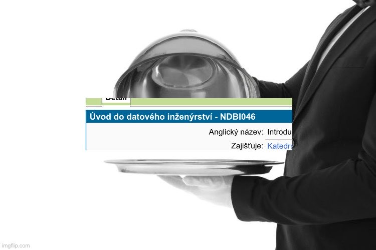

# Webíci materiály

Materiály pro všechny přátele Webíku a databází.
Budou tu časem i materiály na naše státnice.

## Pokryté předměty

- [Architektury softwarových systémů](https://is.cuni.cz/studium/predmety/index.php?do=predmet&kod=NSWI130)
- [Datové formáty](https://is.cuni.cz/studium/predmety/index.php?do=predmet&kod=NPRG036)
- [Moderní databázové systémy](https://is.cuni.cz/studium/predmety/index.php?do=predmet&kod=NDBI040)
- [Úvod do datového inženýrství](https://is.cuni.cz/studium/predmety/index.php?do=predmet&kod=NDBI046)

## Chybějící předměty

- [Vývoj databázových aplikací](https://is.cuni.cz/studium/predmety/index.php?do=predmet&kod=NDBI026) - _necháváme jako cvičení pro čtenáře_
- [Principy organizace dat](https://is.cuni.cz/studium/predmety/index.php?do=predmet&kod=NDBI007) - _necháváme jako cvičení pro čtenáře_
