<script type="text/javascript" src="http://cdn.mathjax.org/mathjax/latest/MathJax.js?config=TeX-AMS-MML_HTMLorMML"></script>
<script type="text/x-mathjax-config">
  MathJax.Hub.Config({ tex2jax: {inlineMath: [['$', '$']]}, messageStyle: "none" });
</script>

# **Materiály ke zkoušce z Moderních databázových systémů**

[**Stránky předmětu**](https://www.ksi.mff.cuni.cz/~holubova/NDBI040/)

## Osnova

- [Vrstvy databázových modelů](#vrstvy-databázových-modelů)
- [Big Data](#big-data)
  - [Definice](#definice-podle-gartneru---společnost-pro-it-analýzy-a-poradenství)
  - [Zdroje Big Data](#zdroje-big-data)
  - [Hlavní charakteristiky Big Data](#hlavní-charakteristiky-big-data)
  - [Zpracování Big Data](#zpracování-big-data)
- [Výhody NoSQL databází](#výhody-nosql-databází)
- [MapReduce](#mapreduce)
- [Apache Spark](#apache-spark)
  - [RDD operace](#rdd-operace)
    - [Transformace](#rdd-transformace)
    - [Akce](#rdd-akce)
- [Distribuční modely](#distribucni-modely)
- [Cloud computing](#cloud-computing)

---

# **Vrstvy databázových modelů**

### **Konceptuální vrstva**

- Modelování domény (reálné věci ze světa).
- Vysoká míra abstrakce.
- Používají se modely jako ER, UML.

### **Logická vrstva**

- Datové struktury pro uložení dat.
- Typy: relační, objektová, XML, grafová apod.

### **Fyzická vrstva**

- Skutečná implementace datových struktur z logické vrstvy.
- Obsahuje indexaci, datové soubory a jejich dělení.

---

# **Big Data**

### **Definice (podle Gartneru - společnost pro IT analýzy a poradenství):**

- **Volume** – velké objemy dat.
- **Variety** – různorodost dat.
- **Velocity** – rychlost generování a zpracování dat.
- (**\*Veracity** – neucelenost dat\*)

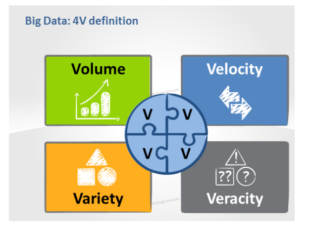

---

### **Zdroje Big Data**

- Sociální sítě.
- Vědecké nástroje.
- Mobilní zařízení.
- Senzory.

---

### **Hlavní charakteristiky Big Data**

#### **1. Volume (objem)**

- Velikost dat neustále exponenciálně roste.

#### **2. Variety (různorodost)**

- Podpora různých datových formátů, typů a struktur.
- Data mohou být strukturovaná, částečně strukturovaná, nebo zcela bez struktury.

#### **3. Velocity (rychlost)**

- Data jsou generována a musí být zpracována v reálném čase.

#### **4. Veracity (věrohodnost)**

- Řešení problémů jako inkonzistence, latence a neucelenost dat.

---

## **Zpracování Big Data**

### **OLTP: Online Transaction Processing**

- Používá se v DBMS a databázových aplikacích.
- Slouží k ukládání, dotazování a přístupu k datům.

### **OLAP: Online Analytical Processing**

- Multi-dimenzionální analytické dotazy.
- Patří do sekce BI (Business Intelligence).

### **RTAP: Real-Time Analytic Processing**

- Data jsou zpracovávána jako stream v reálném čase.
- Klíčové pro moderní Big Data architektury.

---

# **Výhody NoSQL databází**

### **1. Škálování**

- Horizontální škálování ("scaling out") oproti tradičnímu vertikálnímu škálování ("scaling up").

### **2. Big Data podpora**

- RDBMS nezvládají nové velké objemy dat.

### **3. Administrace**

- Automatické opravy, distribuovanost, a self-tuning.

### **4. Náklady**

- Nižší cena za transakci díky horizontálnímu škálování a využití [komoditního hardwaru](https://www.techtarget.com/whatis/definition/commodity-hardware).

### **5. Flexibilita**

- Absence pevného schématu umožňuje snadné strukturální změny bez vysokých nákladů.

---

## **Výzvy NoSQL databází**

- Nižší vyspělost technologií.
- Omezená podpora analytických nástrojů a BI.
- Nedostatek odborníků.

---

## **Datové předpoklady**

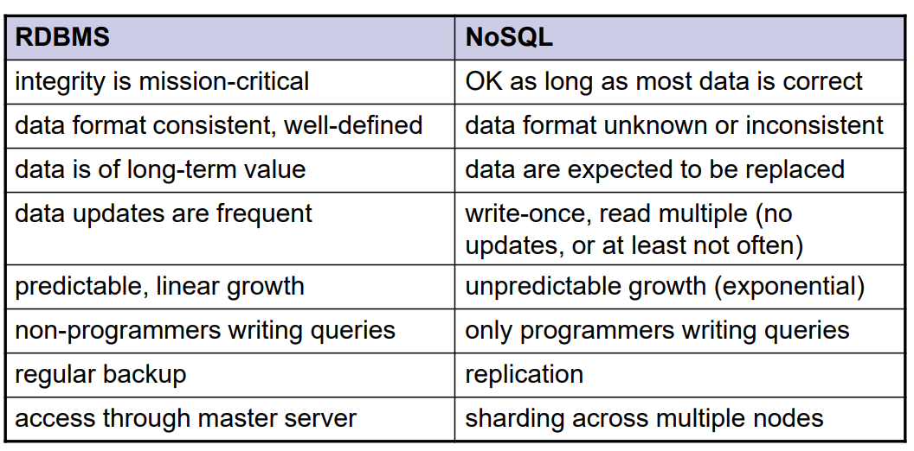

---

# HDFS

- Hadoop Distributed File System
- Škálovatelný a opensource

## Apache Hadoop

- opensource framework s nástroji pro zpracování Big Data
- vyšel z Google MapReducs a GFS (Google File System)
- nástroje (komponenty) Hadoopu:
  - HDFS - distribuovaný file systémů
  - Hadoop YARN - scheduling a resource management clusterů
  - Hadoop MapReduce - paralelní zpracování dat

## Fault tolerance v HDFS

- _"failure is the norm rather than exception"_
- očekáváme, že vždy nějaká část nefunguje
- detekce chyb a auto recovery

## Typ dat v HDFS

- data proudí ve streamu
- automatický batch Processing
- write-once / read-many

## Nodes v HDFS

- Master / Slave archikektura
- HDFS využivá celý FS namespace
- Soubory jsou děleny na bloky (64MB, 128MB apod)

### NameNode

- master server
- řídí namespace
- regulace přístupu klientů
- řeší operace se soubory a adresáři
- určuje mapování bloků na DataNodes
- přijímá **HeartBeat** a **BlockReport** od DataNodes

#### Jak funguje NameNode

- Používá transakční log - **EditLog**
  - Zaznamenává všechny změny v meta datech FS (tvorba souboru, změna repliačního faktoru)
  - je uložen ve FS NameNodu
- **FsImage** - celý FS namespace s mapováním bloků na soubory
  - opět uložen v lokálním FS NameNodu
  - Je načten do paměti NameNodu (4GB RAM stačí)

#### Proces zapnutí systému z pohledu NameNode:

1. NameNode přečte FsImage a EditLog z disku
2. Aplikuje všechny operace v EditLogu na FsImage reprezentaci
3. Udělá **CheckPoint** - Flush out této verze systému do nového FsImage
4. Zkrátí EditLog

### DataNode

- provádí r/w requesty
- práce s bloky - tvorba, mazání a replikace na příkaz NameNode

#### Jak funguje DataNode

- Ukládá data do souborů ve vlastním FS
- Každý blok HDFS je samostatný soubor
- Netvoří všechny soubory ve stejném adresáři (využívá nějakou heuristiku)

#### Proces zapnutí systému z pohledu DataNode:

1. Generace seznamu všech svých HDFS bloků = **BlockReport**
2. Odešle **BlockReport** NameNodu

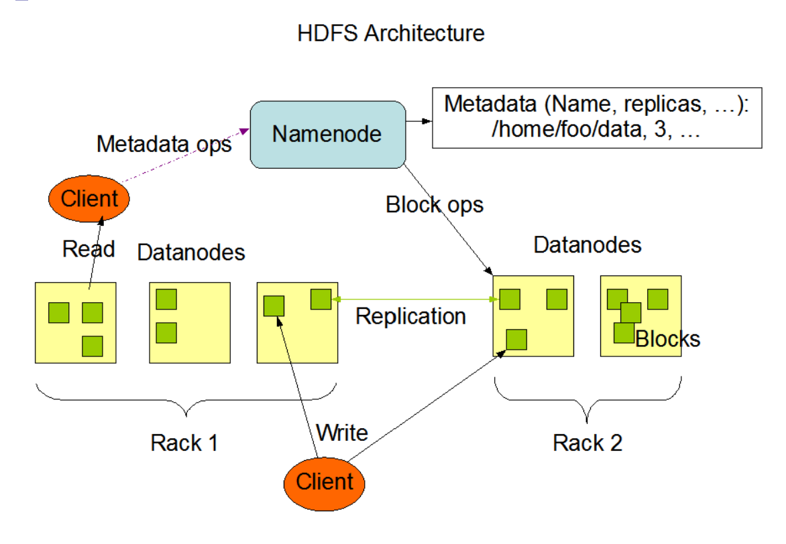

## Namespace

- Hierarchický FS
- CRUD operace
- NameNode je správcem FS - zaznamenává změny
- Aplikace si specifkuje replikační faktor a to je uloženo v NameNode

## Replikace

- soubor je rozdělen na posloupnost bloků
- bloky mají stejnou velikost až na poslední
- velikost bloku lze nastavit
- replikace je nastavitelná
- zajišťuje fault toleranci

## Umístění replik

### Rack-aware

- bereme v potaz fyzickou lokaci uzly
- uzly jsou děleny do racků
- racky mezi sebou komunikují skrze switche
- NameNode určí rack id pro každou DataNode
- jednoduchý přístup: umístíme uzly do jiných racků => drahé zápisy

#### Standartní přístup

- replikační faktor je 3
- Repliky jsou umístěný následovně:
  - Jedna v uzlu na lokálním racku
  - Jedna na jiném uzlu v lokálním racku
  - Jedna na uzlu v jiném racku

## Chyby

### Network Failure

- ztráta připojení DataNodes k NameNode
- DataNodes přestanou posílat heartbeat a jsou NameNode označeny
- DataNode k nim neposílá I/O požadavky

### DataNode Failure

- může klesnout počet replik pod replikační faktor => nutnost re-replikace

# MapReduce

- Využívá paradigma **Rozděl a panuj**

## Faze Map

- Input: key/value páry
- Output: množina dočasných key/value párů - typicky jiná doména než input
- formálně: `(k_1, v_1) -> list(k_2, v_2)`

## Faze Reduce

- Input: Dočasný klíč a množina všech hodnot pro ten klíč
- Output: Menší množina hodnot ve stejné doméně
- formálně: `(k_2, list(v_2)) -> list(k_2, possibly smaller list(v_2))`

## Příklady MapReduce:

### Word Frequency

```
map(String key, String value):
    // key: document name
    // value: document contents
    for each word w in value:
        EmitIntermediate(w, "1");
```

```
reduce(String key, Iterator values):
    // key: a word
    // values: a list of counts
    int result = 0;
    for each v in values:
        result += ParseInt(v);
    Emit(key, AsString(result));
```

## Části MapReduce

### Input reader

- dělí vstup na části => kazda cast nalezi jedne map funkci
- generuje key / value pary

### Map funkce

- uzivatelem specifkovane zpracovani key / value paru

### Partition funkce

- dostane klice z map funkce a pocet reduceru
- vrati index reduceru, ktery se ma pouzit
- typicky zaheshujeme klic a modulime poctem reduceru

### Compare funkce

- setridi vstup do reduce funkce

### Reduce funkce

- uzivatelem specifkovane zpracovani key / values

### Output writer

- zapise vysledek reduce funkce do stabilniho uloziste

## Prubeh mapreduce

1. MapReduce knihovna rozdeli vstupni soubory do M casti (16MB - 64MB na cast)
2. Start kopii mapreduce na clusteru
3. Mame M map tasku a R reduce tasku
4. Master vybere IDLE workera a priradi mu jednu map nebo reduce tasku

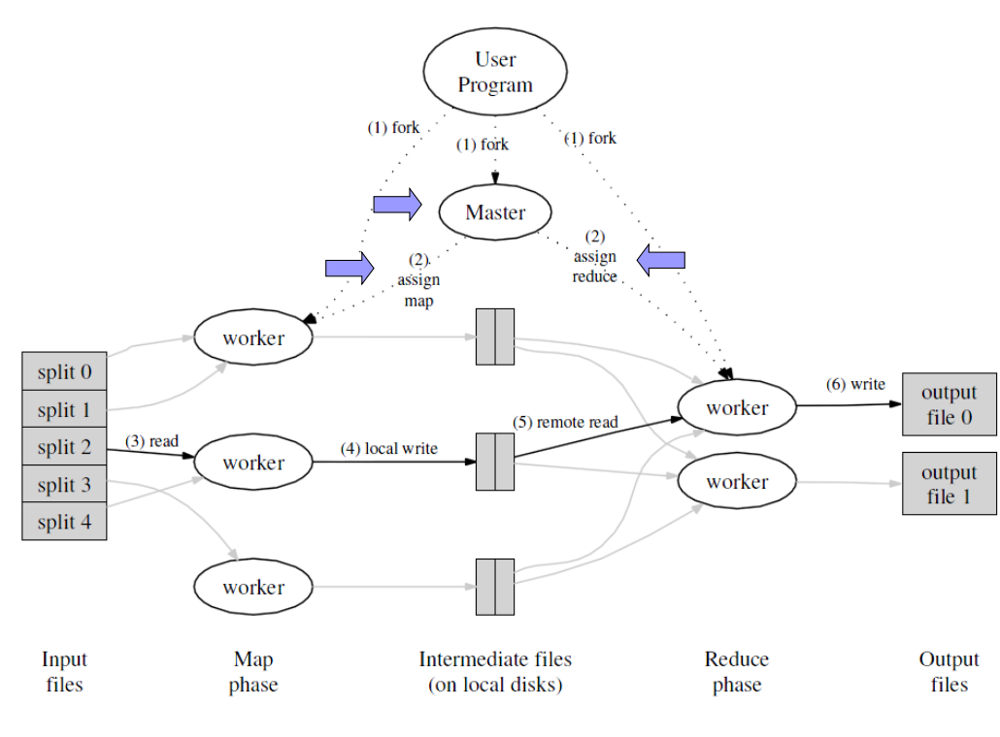

5. Worker s Map taskem precete obsah splitu na inputu
6. Naparsuje key/value pary ze vstupu
7. Preda pary do uzivatelem specifikovane Map funkce
8. Jsou vytvoreny docasne key/value pary a ulozeny do pameti

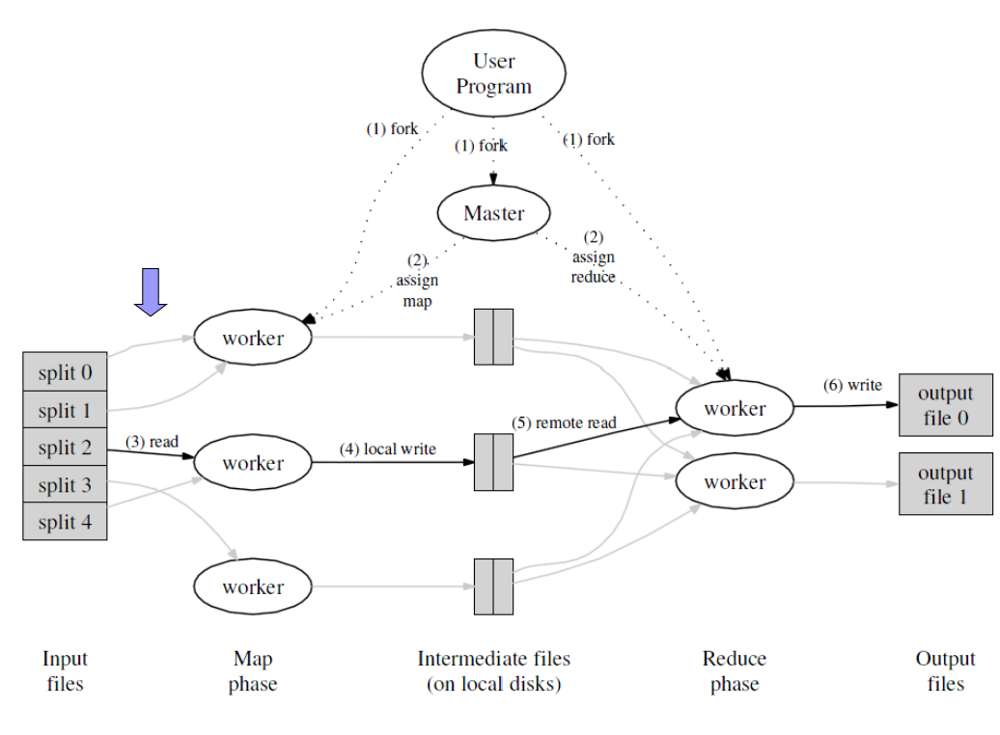

9. Key / value pary z pameti jsou periodicky zapsany na lokalni disk
10. Poloha paru na disku je forwardovana masterovi

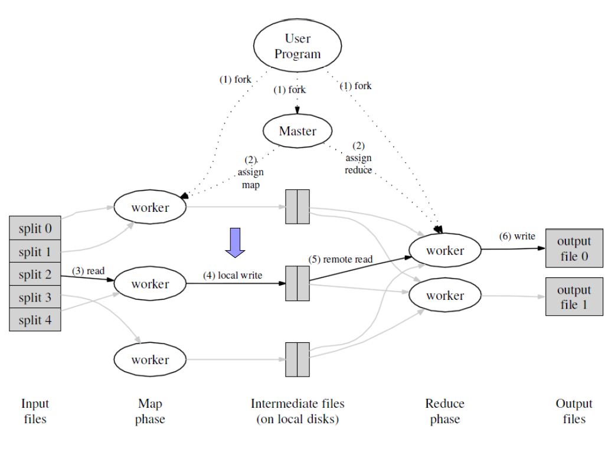

11. Master notifikuje Reduce workery o poloze dat na disku
12. Reduce worker pouzije RPC k ziskani dat z lokalniho disku map workeru
13. Az ma reduce worker vsechna docasna data, setridi je podle docasnych klicu

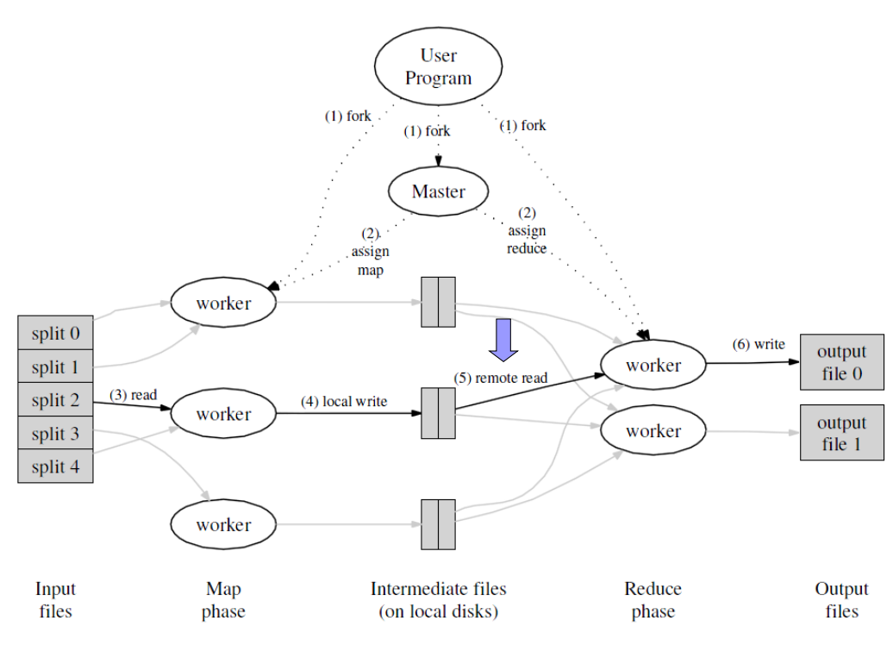

14. Reduce worker iteruje pres setrizena docasna data
15. Pro kazdy docasny klic pripneme jehp hodnotu do output filu pro tuto reduce partition

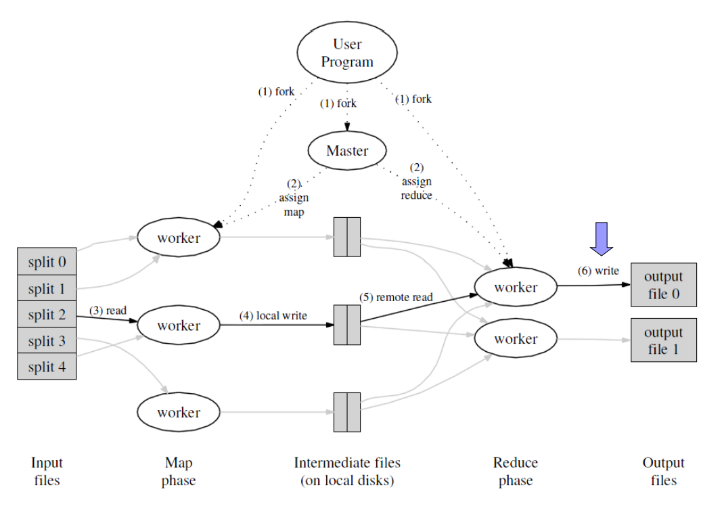

## Combine funkce

- uzivatelem specifikovana funkce
- neco jako reduce funkce ale jeste v map fazi
- bezi pres lokalni data v mapperu
- slouzi ke kompresi posilaneho souboru

## Counters

- uzivatel muze priradit pocitadlo k jakekoliv akci mapperi / reduceru

## Fault Tolerance

### Worker Failure

- master pinguje workery
- pokud worker neodpovida, je oznacen za failed
- vsechny jeho tasky jsou naplanovany zpet do puvodniho idle stavu
- jeho tasky si pak rozeberou od zacatku jini workeri

### Master Failure

- 2 strategie

#### Strategie A

- master si dela periodicke checkpointy master datovych struktur
- pokud master zemre, nova kopie je nastartovana z pozice posledniho checkpointu

#### Strategie B

- Jeden master -> jeho selhani je malo pravdepodobne
- Pokud selze, cely prubeh MapReduce se zahodi

## Stragglers

- "struggler"
- stroj, ktery je pomaly -> nektere casti mu trvaji nezvykle dlouho

### Reseni straggleru:

- tesne pred dokoncenim MapReduce operace master naplanuje backup executions zbylych zapocatych tasku
- task je oznacena za hotovou, pokud jeji primarni nebo backup vykonavani je dokonceno

## Granularita tasku

- M casti Map faze
- R casti Reduce faze
- Master provede `O(M + R)` scheduling rozhodnuti
- Master uchovava `O(M * R)` status informaci v pameti
- R je typicky omezeno uzivatelem

# Hadoop MapReduce

- HDFS + JobTracker (master) + TaskTracker (slave)

## JobTracker

- Master
- pracuje jako scheduler - deleguje praci do TaskTrackeru
- komunikuje s NameNode (HDFS master) a vyhleda TaskTracker (Hadoop client) pobliz dat
- presune skutecnou praci do TaskTracker uzlu

## TaskTracker

- client
- Prijima tasky od JobTrackeru
- Map, Reduce, Combine
- Input a output cesty
- Ma omezeny pocet task slotu
- Pro kazdy task vyobi novou instanci JVM (Java Virtual Machine)
- Pocet volnych slotu posila pres heartbeat JobTrackeru

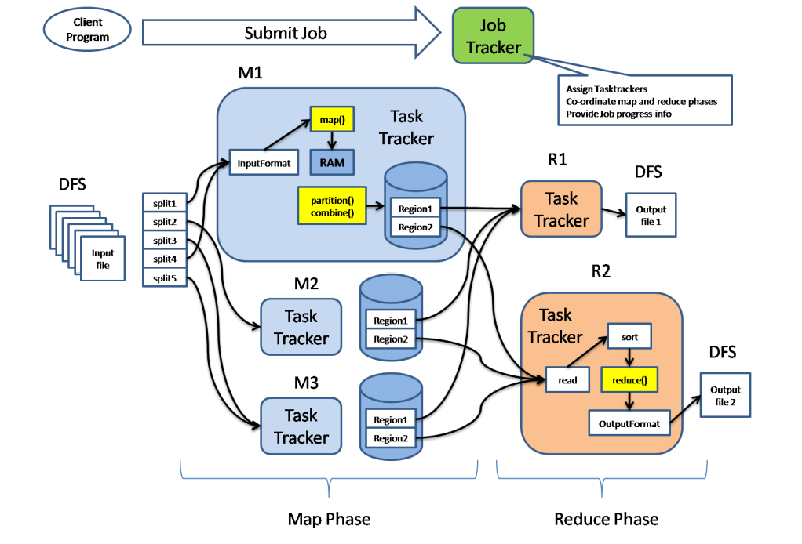

# Apache Spark

- data analytics engine
- narozdil od Hadoop MapReduce je rychlejsi diky praci in memory narozdil od disk I/O, ktery zpomaloval MapReduce
- podporuje taky Spark SQL

## Driver program

- Spark Aplikace = driver program
- Obsahuje uzivatelem specifikovany kod pro dany problem a provadi orchestraci
- koordinuje paralelni zpracovani
- nasloucha executorum (worker nodes)
- mela by bezet blizko worker nodes (idealni v jedne LAN)
- Je spravovan skrze Web UI (ukazoval nam Yaghob v Cloudu)

## SparkContext

- centralni entita v driver programu
- koordinace mezi driverem a cluste managerem
- ridi resourcy a provadeni tasku

## ClusterManager

- spark si muze vybrat Cluster Managera
- externi system, ktery alokuje resourcy
- Priklady: Kubernetes, YARN (Resource Manager Hadoopu), Apache Mesos

## Resilient Distributed Dataset (RDD)

- immutabilni
- kolekce elementu rozdelenych mezi uzly v clusteru
- automaticka recovery
- lze persistovat v pameti (volani `persist` nebo `cache` funkci)
- paralelni zpracovani

### Jak vytvorit RDD

- paralelizujeme existujici kolekci v driver programu

```Java
List<Integer> data = Arrays.asList(1, 2, 3, 4, 5);
JavaRDD<Integer> distData = sc.parallelize(data);
```

- reference na externi dataset (treba v HDFS nebo Local file system) podporovany **Hadoopem**

```Java
JavaRDD<String> distFile = sc.textFile("data.txt");
```

## RDD operace

- delime na Transformace a Akce

## RDD Transformace

- vytvoreni noveho datasetu z existujiciho
- prakticky `map` funkce

### **1. `map(func)`**

- **Popis:** Vytvoří nové rozdělené dataset (`RDD`), kde každý prvek původního datasetu je transformován funkcí `func`.

```java
// Příklad: Zvětší každý prvek o 1
JavaRDD<Integer> rdd = sc.parallelize(Arrays.asList(1, 2, 3, 4));
JavaRDD<Integer> mappedRDD = rdd.map(x -> x + 1);
```

---

### **2. `union(otherDataset)`**

- **Popis:** Spojí dva dataset (`RDD`) a vrátí nový dataset, který obsahuje všechny prvky z obou.

```java
// Příklad: Spojení dvou datasetů
JavaRDD<Integer> rdd1 = sc.parallelize(Arrays.asList(1, 2, 3));
JavaRDD<Integer> rdd2 = sc.parallelize(Arrays.asList(4, 5, 6));
JavaRDD<Integer> unionRDD = rdd1.union(rdd2);
```

---

### **3. `filter(func)`**

- **Popis:** Vrátí nový dataset, který obsahuje pouze prvky, na kterých funkce `func` vrátí `true`.

```java
// Příklad: Filtrace sudých čísel
JavaRDD<Integer> rdd = sc.parallelize(Arrays.asList(1, 2, 3, 4));
JavaRDD<Integer> filteredRDD = rdd.filter(x -> x % 2 == 0);
```

---

### **4. `reduceByKey(func, [numPartitions])`**

- **Popis:** Pokud pracujete s páry `(K, V)`, agreguje hodnoty pro každý klíč pomocí funkce `func`. Volitelně můžete nastavit počet oddílů.

```java
// Příklad: Sčítání hodnot podle klíče
JavaPairRDD<String, Integer> pairs = sc.parallelizePairs(Arrays.asList(
    new Tuple2<>("a", 1),
    new Tuple2<>("b", 2),
    new Tuple2<>("a", 3)
));
JavaPairRDD<String, Integer> reducedRDD = pairs.reduceByKey((x, y) -> x + y);
```

---

### **5. `sortByKey([ascending], [numPartitions])`**

- **Popis:** Seřadí páry `(K, V)` podle klíče. Můžete zvolit vzestupné (`true`) nebo sestupné (`false`) řazení.

```java
// Příklad: Seřazení párů podle klíče vzestupně
JavaPairRDD<String, Integer> pairs = sc.parallelizePairs(Arrays.asList(
    new Tuple2<>("b", 2),
    new Tuple2<>("a", 1),
    new Tuple2<>("c", 3)
));
JavaPairRDD<String, Integer> sortedRDD = pairs.sortByKey(true);
```

---

### Další funkce:

- **`intersection`**: Vrátí dataset s prvky, které se nachází v obou vstupech.
- **`distinct`**: Vrátí dataset obsahující pouze unikátní prvky.

```java
// Příklad: Unikátní prvky
JavaRDD<Integer> rdd = sc.parallelize(Arrays.asList(1, 2, 2, 3, 4, 4));
JavaRDD<Integer> distinctRDD = rdd.distinct();
```

## RDD Akce

- vratime hodnotu do driveru po nejaky vypoctu nad datasetem
- prakticky `reduce` funkce

### **1. `reduce(func)`**

- **Popis:** Agreguje prvky datasetu pomocí funkce `func`. Funkce musí být **komutativní** a **asociativní**, aby výpočet mohl probíhat paralelně.

```java
// Příklad: Součet všech čísel v datasetu
JavaRDD<Integer> rdd = sc.parallelize(Arrays.asList(1, 2, 3, 4));
Integer sum = rdd.reduce((x, y) -> x + y);
```

---

### **2. `count()`**

- **Popis:** Vrátí počet prvků v datasetu.

```java
// Příklad: Spočítání prvků v datasetu
JavaRDD<Integer> rdd = sc.parallelize(Arrays.asList(1, 2, 3, 4));
long count = rdd.count();
```

---

### **3. `first()`**

- **Popis:** Vrátí první prvek datasetu.

```java
// Příklad: Získání prvního prvku
JavaRDD<Integer> rdd = sc.parallelize(Arrays.asList(1, 2, 3, 4));
Integer firstElement = rdd.first();
```

---

### **4. `take(n)`**

- **Popis:** Vrátí pole s prvních `n` prvky datasetu.

```java
// Příklad: Získání prvních 2 prvků
JavaRDD<Integer> rdd = sc.parallelize(Arrays.asList(1, 2, 3, 4));
List<Integer> firstTwo = rdd.take(2);
```

---

### **5. `takeOrdered(n, [ordering])`**

- **Popis:** Vrátí prvních `n` prvků datasetu, seřazených buď podle jejich přirozeného pořadí, nebo podle vlastní komparace.

```java
// Příklad: Získání 2 nejmenších prvků
JavaRDD<Integer> rdd = sc.parallelize(Arrays.asList(4, 2, 3, 1));
List<Integer> smallestTwo = rdd.takeOrdered(2); // Výsledek: [1, 2]

// Příklad s vlastním pořadím (sestupně)
List<Integer> largestTwo = rdd.takeOrdered(2, Comparator.reverseOrder()); // Výsledek: [4, 3]
```

## Shuffle Operace

- nektere akce spousti shuffle
- shuffle = mechanismus pro redistribuci dat pres partitions
- nutnost kopirovani dat mezi executory a stroji

### Priklad Shuffle Operace: ReduceByKey

- Problém: Hodnoty stejného klíče mohou být v různých partitions nebo na různých strojích v clusteru
- Řešení (Shuffle): Spark načte hodnoty stejného klíče ze všech paritions, spojí je dohromady a spočítá finální výsledek

## RDD vs DataFrame vs Dataset

- RDD = primarni API ve Sparku, neobsahuje optimaliyace jako DataFrame nebo Dataset
- DataFrame = data jsou organizovana do pojmenovanych sloupcu
  - Weak typing: `Dataset<Row>`
  - Kolekce generických objektů
  - Jednodussi prace s daty (jako tabulka v SQL)
- Dataset = distribuovana kolekce dat
  - Strong typing: `Dataset<T>`, kde `T` je definice tridy
  - Neco jako RDD s podporou Spark SQL zaroven

> Spark 2.0 sjednotil DataFrame a Dataset do jedné struktury s dvěma API:

> Nepřísně typované API (DataFrame): Pro jednoduchost a SQL-like operace.
> Silně typované API (Dataset): Pro typovou bezpečnost a práci s konkrétními třídami.

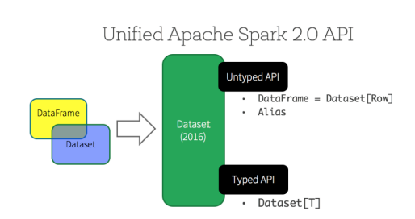

# Principy MDBS

- vzdáme se něketerých ACID vlastností
- Ze silné konzistence -> slabá konzistence

## Scalability

### Vertikalni scaling (scaling up)

- v historii preferovano
- zarucovalo strong consistency (protoze stacil jen jeden stroj)
- Vendor lock-in
- drahe
- stale existuje limit pro silu a kapacitu jednoho stroje

### Horizontalni scaling (scaling out)

- system distribuujeme pres vice stroju / uzlu
- staci komoditni hardware

### Klamy (fallacies) horizontalniho scalingu

- Sit je spolehliva
- Nulova letence
- Nekonecny bandwidth
- Sit je bezpecna
- Topologie se nemeni
- Mame pouze jednoho spravce
- Nulova cena transportu
- Sit je homogenni

## ACID

- typicke vlastnosti ocekavane u relacnich DBMS
- Databzova transakce = jednotka prace (sekvence operaci) v DBMS
- tyto vlastnosti jsou ale prilis drahe v distribuovanych systemech
- Atomicity - vse nebo nic, jedna selhana cast transakce = cela transakce selhala
- Consistency - databaze se presouva pouze mezi konzistentnimi stavy
- Isolation - efekty nedokonceene transakce (v prubehu, failed) nejsou viditelne zvenku
- Durability - po commitu transakce zustane transkace commited (i pres vypadek elektriny, errory)

## CAP Theorem

- CAP ma 3 casti
- Obecne ale nedava smysl, protoze definice nejsou dostatecne presne (napr. pouze CP by naznacovalo nikdy available)

**Theorem:** `Only 2 of the 3 guarantees can be given in a “shared-data” system`

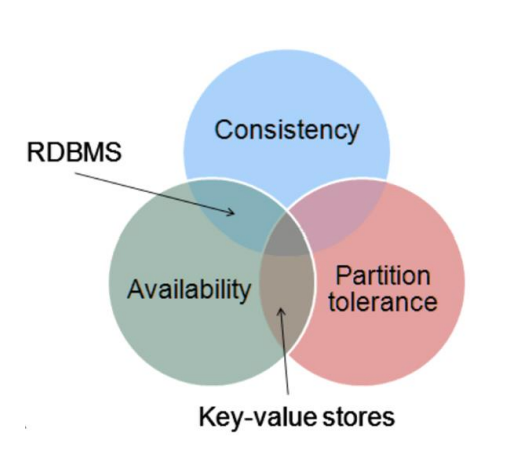

### Consistency

- po zmene dat, vsechny cteni maji videt stejna data
- vsechny uzly maji vzdy obsahovat stejna data

### Availability

- vsechny dotazy (cteni, zapisy) dostanou vzdy odpoved
- nazavisle na vypadcich

### Partition Tolerance

- system funguje i po izolovani podcasti systemu
- problemy s pripojenim neshodi system pokud je system fault tolerantni

## BASE

- lepe skalovatelny
- sada principu jako ACID

### Basically Available

- system funguje prakticky vetsinu casu
- castecne vypadky se deji ale bez selhani celeho systemu

### Soft State

- system se neustale meni
- stav systemu je nedeterministicky (kontrast vuci consistency v ACIDu, kde vzdy mame nejaky pevny stav)

### Eventual Consistency

- nekdy v budoucnu bude system konzistentni (az treba vsechny stroje budou synced)

## ACID vs BASE

- ACID garantuje _Consistency_ a _Availability_
  - pesimisticky pristup
  - toto dovoluje DB pouze na jednom stroji
- BASE garantuje _Availability_ a _Partition
  tolerance_
  - optimisticke
  - distribuovane databaze
- samostatny system je `CA` system

## Silna konzistence

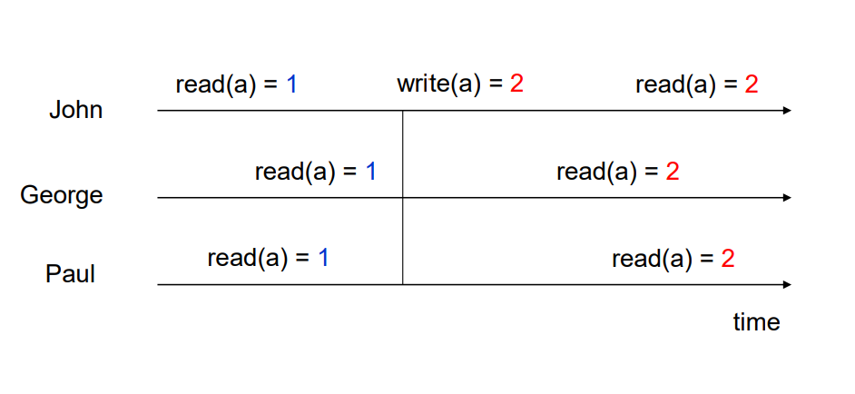

## Eventualni konzistence

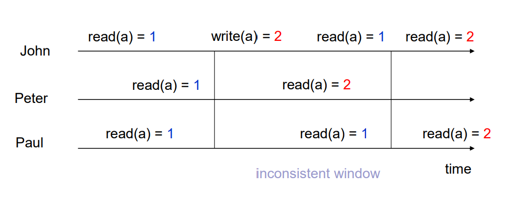

# Distribucni modely

- Horizontalni scaling = databaze bezi na clusteru serveru
- Mame dva ortogonalni pristupy (= pristupy, ktere mohou byt aplikovany zaroven. Jsou v jinych dimenzich / pohledech na vec)
  - **Replikace** - kopirovani stejnych dat pres uzly (master-slave nebo peer-to-peer)
  - **Sharding** - jina data na jinych uzlech

## Single server

- bez jakekoliv distribuce
- DB pouze na tomto stroji
- Dobre treba pro Grafove DB -> slozita distribuce

## Sharding

- davame ruzna data na ruzne uzly
- idealne chceme pohromade data, ke kterym pristupujeme casto dohromady
- selhani uzlu -> jeho data jsou nedostupna (proto casto kombinujeme s replikaci)

### Rozmisteni uzlu

<ol type="A">
  <li>Jeden uživatel bere data z jednoho serveru</li>
  <li>Fyzická poloha</li>
  <li>Distribuujeme rovnoměrně přes uzly</li>
</ol>

## Master-slave Replikace

- jeden uzel je primarni (master), zbytek sekundarni (slaves)
- master zodpovida za zpracovani a update dat
- master limituje svoji schopnosti zpracovani updatu
- Problemy:
  - skalovatelnost zapisu (master je bottleneck)
  - nechrani pred selhanim mastera

### Volba mastera

- Manualni: user-defined
- Auomaticka: cluster-elected

## Peer-to-peer replikace

- resi mnoho problemu master-slave replikace
- bez mastera
- Problem: konzistence
  - zapisem na 2 mista vznika write-write konflikt
- Reseni:
  - pri zapisu dat repliky koordinuji pro zabraneni konfliktu
  - vsechny repliky nemusi souhlasit, staci vetsina

## Kombinace Shardingu a Replikace

### Master-slave replikace a sharding

- vice masteru, ale master je pouze pro nejaky dany datovy item
- uzel muze byt master pro nejaka data a slave pro jina

### Peer-to-peer replikace a sharding

- casta strategie pro sloupcove DB
- idealne replikacni faktor 3, takze kazdy shard je na 3 uzlech

### Konzistence

#### **Write Consistency (Konzistence zápisu)**

- **Problém:** Dva uživatelé chtějí upravit stejný záznam (write-write konflikt).
- **Důsledek:**
  - Ztracený update: Druhá transakce přepíše hodnotu z první transakce.
  - Ostatní transakce čtou nesprávnou hodnotu a vrací špatné výsledky.
- **Řešení:**
  - **Pesimistické:** Zabraňuje konfliktům (např. write lock).
  - **Optimistické:** Konflikty se nechají proběhnout, ale následně se detekují a řeší (např. podmíněný update nebo uložení obou hodnot jako konflikt).

#### **Read Consistency (Konzistence čtení)**

- **Problém:** Jeden uživatel čte, zatímco druhý zapisuje (read-write konflikt).
- **Důsledek:**
  - Nekonzistentní čtení: Hodnota objektu se mezi dvěma čteními změní.
  - Transakce, které čtou starou hodnotu, mohou vracet chybné výsledky.
- **Databáze:**
  - **Relační databáze:** Podporují ACID transakce (zajišťují konzistenci).
  - **NoSQL databáze:** Často podporují atomické operace jen v rámci jedné "agregace".
    - Pokud je update napříč více agregacemi, může dojít k **oknu nekonzistence**.
- **Další problém:** Konzistence replikace
  - Zajistit, aby všechny repliky měly stejnou hodnotu při čtení.

#### **Quorums (Kvóra)**

- **Otázka:** Kolik uzlů je potřeba zapojit pro zajištění silné konzistence?
- **Write quorum:** Počet uzlů potvrzujících zápis musí být:
  $$ W > \frac{N}{2} $$

  - \( N \) = počet uzlů v replikaci (replikační faktor).
  - \( W \) = počet uzlů zapojených do zápisu.

- **Read quorum:** Počet uzlů nutných pro čtení:
  $$ R + W > N $$
  - \( R \) = počet uzlů kontaktovaných pro čtení.
- **Princip:**
  - Zápisy s konflikty: Pouze jeden může získat většinu.
  - Pro zajištění aktuální hodnoty musíme kontaktovat dostatečný počet uzlů.

# Zpracovani Big Data

## Priklady ukolu pro Big Data

- analyza
- visualizace
- agregace
- manipulace a uprava dat

## Cloud computing

- Pronajem hw/sw (servery, data, software...) poptavce
- [Virtualizace a cloud computing předmět](https://is.cuni.cz/studium/predmety/index.php?do=predmet&kod=NSWI150)

### Modely cloudových služeb:

- **Software as a Service (SaaS):**

  - Primo hotovy sw produkt
  - zoom, shopify, slack

- **Platform as a Service (PaaS):**

  - Prostredi pro devs pro nasazeni a vyvoj vcetne HW
  - Nastavena DB, security, data security, hosting
  - Microsoft Azure, AWS Lambda

- **Infrastructure as a Service (IaaS):**
  - primo hw a infrastruktura (nejnizsi model)

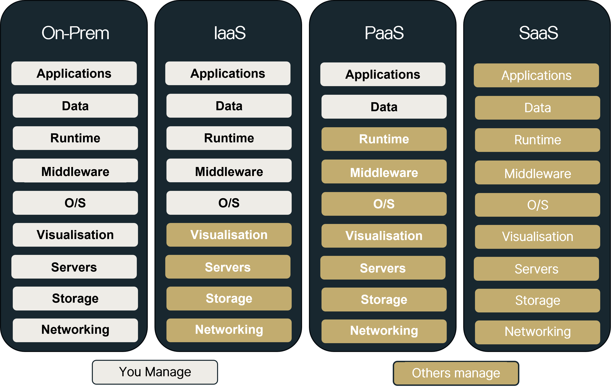

### Spojeni Cloud computingu a Big Data

- nemusime resit drahy HW, instalaci a udrzbu
- jednoducha skalovatelnost
- nevyhoda je vendor lock-in

# Key-value databaze

- prakticky hash table
- hodnota je BLOB (nespecifikovany typ a struktura - muze byt cokoliv)

## Priklady

- Riak
- Redis
- MemcachedDB

## Vhodna vyuziti

- ### Session info
  - klicem je `session_id`
  - k ulozeni session staci `put` a pro dotaz jednoduchy `get`
- ### Nakupni kosiky
  - podobne jako Session info
- ### User preference

## Nevhodna vyuziti

- ### Vztahy mezi daty
- ### Transakce s vice operacemi
  - Ukladame vice klicu -> jedno selhani -> zadny z klicu v transakci se neulozi (revert / roll back)
- ### Dotazy na obsah dat

## Dotazovani

- dotazujeme se pomoci klice
- pomoci obsahu dat neni mozne (BLOB -> data nemusi byt jakkoliv definovana)
- klice jsou generovany nejakym algoritmem (auto incremenet), user generated nebo treba time stamps

# Riak (Key-value -> multimodel)

- open source

## Terminologie

- ### `bucket` = namespace pro klice
  - lze pro bucket nastavit replikacni faktor `n_val`
  - `allow_mult` - konkurentni updaty
  - `/riak/<bucket>/<key>`
- ### `ring`
- ### `hinted handoff`
- ### `gossiping`

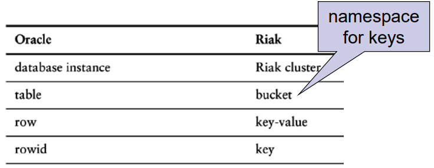

## Principy

- klice jsou ukladany do bucketů (= namespaces)
- default interface je `HTTP`

## Riak Links

- umoznuji tvorit vztahy mezi objekty
- tvori se pridanim `Link` headeru k objektu (pres HTTP)

## Riak Search

- fulltext search engine
- podpora dotazovani na textova data
- pouziti pro hledani zaznamu podle obsahu

### Dotazování v Riak Search

- **Typy dotazů:**
  - **Zástupné znaky:** `Bus*`, `Bus?`
  - **Rozsahy:**
    - `[red TO rum]`: zahrnuje "red", "rum" a všechny mezi nimi
    - `{red TO rum}`: zahrnuje pouze slova mezi "red" a "rum"
  - **Logické operátory:** `(red OR blue) AND NOT yellow`
  - **Prefixové shody:** Vyhledávání podle počátečních písmen
  - **Blízkost:**
    - `"See spot run"~20`: slova v rámci 20 slov

### Proces indexace dat v Riak Search:

1. Načtení dokumentu
2. Rozdělení na pole
3. Rozdělení polí na termíny
4. Normalizace termínů
5. Zápis `{Field, Term, DocumentID}` do indexu

**Indexování:**

```
index <INDEX> <PATH>
```

**Vyhledávání:**

```
search <INDEX> <QUERY>
```

## Priklady Riaku

### **Příklady použití Riaku**

#### **Práce s Buckets:**

1. **Seznam všech buckets:**

   ```bash
   curl http://localhost:10011/riak?buckets=true
   ```

2. **Získání vlastností bucketu `foo`:**

   ```bash
   curl http://localhost:10011/riak/foo/
   ```

3. **Změna vlastností bucketu `foo`:**
   ```bash
   curl -X PUT http://localhost:10011/riak/foo -H "Content-Type: application/json" -d '{"props" : { "n_val" : 2 } }'
   ```

---

#### **Práce s daty:**

1. **Uložení prostého textu do bucketu `foo`:**

   ```bash
   curl -i -H "Content-Type: plain/text" -d "My text" http://localhost:10011/riak/foo/
   ```

2. **Uložení JSON souboru do bucketu `artists` s klíčem `Bruce`:**

   ```bash
   curl -i -H "Content-Type: application/json" -d '{"name":"Bruce"}' http://localhost:10011/riak/artists/Bruce
   ```

3. **Získání objektu:**

   ```bash
   curl http://localhost:10011/riak/artists/Bruce
   ```

4. **Aktualizace objektu:**

   ```bash
   curl -i -X PUT -H "Content-Type: application/json" -d '{"name":"Bruce", "nickname":"The Boss"}' http://localhost:10011/riak/artists/Bruce
   ```

5. **Smazání objektu:**
   ```bash
   curl -i -X DELETE http://localhost:10011/riak/artists/Bruce
   ```

---

#### **Práce s Riak Links:**

1. **Přidání alba a propojení s performerem:**

   ```bash
   curl -H "Content-Type: text/plain" -H 'Link: </riak/artists/Bruce>; riaktag="performer"' -d "The River" http://localhost:10011/riak/albums/TheRiver
   ```

2. **Najít umělce, který provedl album `The River`:**

   ```bash
   curl -i http://localhost:10011/riak/albums/TheRiver/artists,performer,1
   ```

3. **Najít umělce, kteří spolupracovali s tím, kdo provedl `The River`:**
   ```bash
   curl -i http://localhost:10011/riak/albums/TheRiver/artists,_,0/artists,collaborator,1
   ```

## Interni mechanismy Riaku

- `BASE` principy
- pouziva `quora`

  - `N` = replikacni faktor (default = `3`)
  - Zapis: data musi byt zapsana aspon na `W` uzlech
  - Cteni: data musi byt nalezena aspon na `R` uzlech
  - `W` a `R` muzeme nastavit pro kazdou operaci

- Plati tyto nerovnosti:
  $$ W > \frac{N}{2} $$
  $$ R + W > N $$

- **Příklad:**
  - Cluster Riaku má:
    - **`N = 5`** (počet replik)
    - **`W = 3`** (minimální počet uzlů pro potvrzení zápisu)
  - **Zápis je úspěšný, pokud**:
    - Data jsou úspěšně zapsána na více než `3` uzlech
  - **Tolerované výpadky při zápisu:**
    - Cluster zvládne výpadek až **`N - W = 2`** uzlů a stále může provádět zápisy

## Clustering v Riaku

- bez mastera -> kazdy uzel muze obslouzit jakykoliv dotaz

- ### Konzistentni hashovani

  - hashovaci funkce mapuje klice do kruhu
  - kazdy uzel zodpovedny za interval hashu (= `slot`) na kruhu
  - prumerne remapujeme jen `k / n` klicu, kde `k` = pocet klicu a `n` = pocet slotu

## Riak Ring

- stred kazdeho clusteru
- `160-bitovy` prostor celych cisel rozdeleny na rovnomerne intervaly
- ### Kazdy `fyzicky uzel` ma `virtualni uzly` (= vnodes)

  - virtualni uzel je zodpovedny za cast klicu
  - kazdy fyzicky uzel ma na starost `1/ (pocet fyzickych uzlu)` ringu
  - #### Pocet vnodes na kazdem uzlu:

$$
\text{|vnodes\_na\_1\_uzlu|} = \frac{|partitions|}{\text{|fyzicke\_uzly|}}
$$

- ### Priklad:
  - Ring s `32` paritions
  - `4` fyzicke uzly
  - `8` vnodes na fyzicky uzel

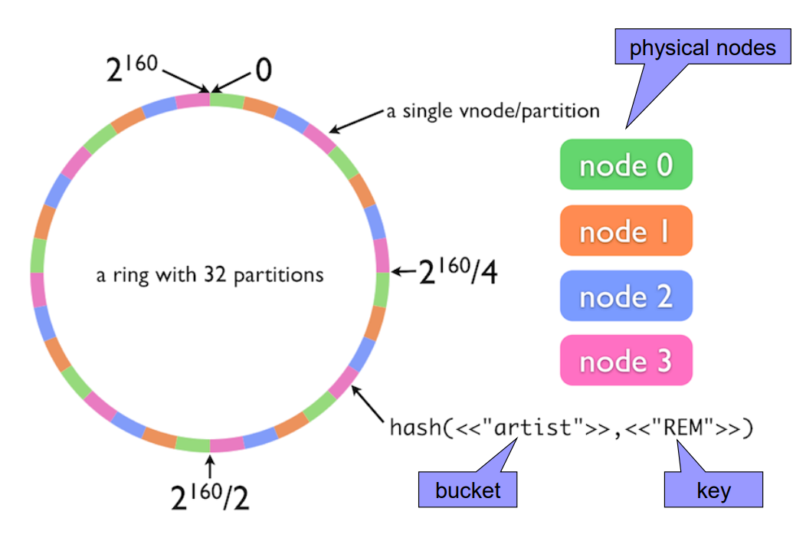

## Replikace v Riaku

- nastavujeme `N value` (default = 3)
- objekty dedi `N value` z jejich bucketu

### Hinted kandoff

- resi selhani uzlu
- funguje diky replikaci
- Zajistuje high availability Riaku

1. **Selhání uzlu:** Pokud uzel v klastru selže, sousední uzly dočasně převezmou jeho úlohu.
2. **Dočasné převzetí:** Sousední uzly zpracovávají čtení a zápisy, aby zajistily dostupnost systému.
3. **Obnova:** Po návratu selhaného uzlu sousední uzly předají všechny mezitímní změny zpět.

**Výhoda:** Systém zůstává dostupný a data nejsou ztracena.

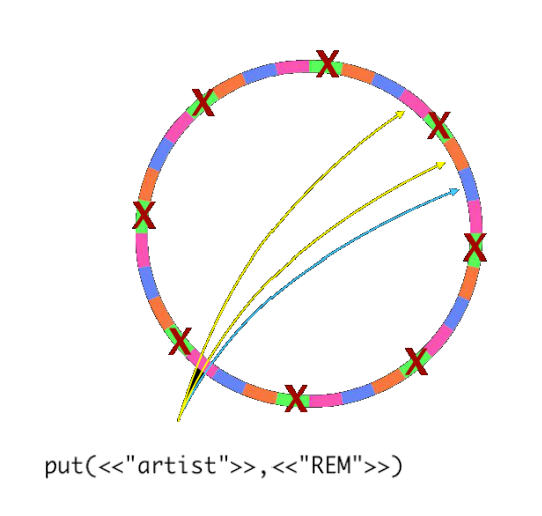

## Gossip protokol

- robustni sireni informaci
- `Gossiping` = posilani informaci nahodnemu uzlu
  - aktualizuje info a clusteru
- kazdy uzel gossipuje
  - periodicky
  - pri zmene na ringu

## Vector clocks

- kazdy uzel muze zpracovavat dotaz -> jaka verze hodnoty je ale aktualni?
- reseni: vector clocks
- kazda ulozena hodnota je tagged vector clockem
- ulozeno v headeru objektu
- pri kazdem updatu je hodnota vector clocku aktualizovana

## Riak siblings

- `siblings` = vicero objektu pod jednim klicem
- aktivovano `allow_mult = true` priznakem
- mohou vzniknout pri konkurentnim zapisu, starych vector clocks, neexistujicich vector clocks

## Koordinující uzel (vnode) v Riaku

1. Najde **vnode** pro klíč pomocí hashovací funkce.
2. Určí další **N-1 vnodes** pro repliky.
3. Odešle požadavek na všechny vybrané **vnodes**.
4. Čeká, dokud dostatečný počet odpovědí nesplní **kvórum** (pro čtení/zápis).
5. Vrátí výsledek klientovi.

# Redis (Key-value + multi-model)

- spise dokumentova multi-model databaze s podporou key-value

## Terminologie

## Principy

- klice jsou `binary safe` -> jakakoliv bina rni posloupnost muze byt klicem (tedy neni omezeni na text nebo citelny obsah)
- hodnota muze byt jakykoliv objekt (string, hash, list, set...)
- podpora pro mnozinove operace (range, diff, union, intersection)

### In-Memory Data Set

- data jsou primarne ulozena v pameti
- persistence je resena dumpingem datasetu na disk / pridanim prikazu do logu

### Publish/subscribe

### Cache-like chovani

- klice mohou mit nastaveny `TTL`
- pak jsou automaticky vymazany -> cache charackteristika

## Datove typy Redisu

### **String**

- **Binary safe:** Klíč může obsahovat libovolnou binární sekvenci.
- **Maximální velikost:** 512 MB.
- **Operace:**
  - Nastavení a načtení: `SET`, `GET`.
  - Modifikace: `APPEND`, `STRLEN`, `SETRANGE`.
  - Operace s čísly: `INCR`, `DECR`, `INCRBY`, `DECRBY`.
  - Bitové operace: `GETBIT`, `SETBIT`, `BITCOUNT`.

**Příklad:**

```plaintext
> SET count 10
OK
> INCR count
(integer) 11
> GET count
"11"
> DEL count
(integer) 1
```

---

### **List**

- **Seřazený seznam řetězců:** Prvky jsou uspořádány podle pořadí vložení.
- **Maximální délka:** Více než 4 miliardy prvků.
- **Operace:**
  - Přidání: `LPUSH` (hlava), `RPUSH` (konec), `LINSERT`.
  - Odebrání: `LPOP`, `RPOP`, `LREM`.
  - Přístup k prvkům: `LRANGE`, `LINDEX`.
  - Délka seznamu: `LLEN`.

**Příklad:**

```plaintext
> LPUSH animals cat
(integer) 1
> RPUSH animals dog
(integer) 2
> LRANGE animals 0 -1
1) "cat"
2) "dog"
```

---

### **Set**

- **Neuspořádaná kolekce unikátních řetězců.**
- **Maximální velikost:** Více než 4 miliardy prvků.
- **Operace:**
  - Přidání/Odebrání: `SADD`, `SREM`.
  - Test členství: `SISMEMBER`.
  - Množinové operace: `SUNION`, `SINTER`, `SDIFF`.

**Příklad:**

```plaintext
> SADD colors red green blue
(integer) 3
> SINTER colors:1 colors:2
1) "green"
```

---

### **Sorted Set**

- **Seřazená kolekce s hodnotami přiřazenými skóre.**
- **Operace:**
  - Přidání/Odebrání: `ZADD`, `ZREM`.
  - Počítání: `ZCARD`, `ZCOUNT`.
  - Získání prvků podle skóre: `ZRANGEBYSCORE`.

**Příklad:**

```plaintext
> ZADD scores 10 Anna 20 John
(integer) 2
> ZRANGE scores 0 -1
1) "Anna"
2) "John"
```

---

### **Hash**

- **Mapa mezi poli a hodnotami řetězců.**
- **Operace:**
  - Nastavení/Načtení: `HSET`, `HGET`, `HMSET`.
  - Všechny hodnoty/pole: `HGETALL`, `HKEYS`, `HVALS`.
  - Smazání: `HDEL`.

**Příklad:**

```plaintext
> HSET user:id name Sara age 25
(integer) 1
> HGET user:id name
"Sara"
> HGETALL user:id
1) "name"
2) "Sara"
3) "age"
4) "25"
```

## Transakce v Redisu

- kazdy prikaz je atomicky
- podporuje transakce pri pouziti vice prikazu (zachova poradi) -> vse v jedne atomicke operaci
- bez roll backu

```plaintext
> MULTI // start definice transakce
OK
> INCR foo
QUEUED
> INCR bar
QUEUED
> EXEC // provedeni transakce
1) (integer) 1
2) (integer) 1
```

## Replikace v Redisu (master-slave)

- master-slave
  - master ma vice slavu
  - uzel muze byt master a slave zaroven
- replikace je `neblokujici` na strane `mastera`
  - pri syncu slavu master pracuje dal
- replikace je `neblokujici` na strane `slavu`
- pri syncu slavu slave pracuje dal

## Synchronizace v Redisu

1. Po připojení k masteru slave odešle příkaz **SYNC**.
2. Master spustí **background saving** a začne ukládat nové příkazy do bufferu.
3. Po dokončení uložení master přenese celý soubor databáze na slave.
4. Slave uloží soubor na disk a načte jej do paměti.
5. Master pošle slave také všechny **bufferované příkazy**.

## Sharding v Redisu

### Redis Cluster (od verze 3.1)

- **Nepoužívá konzistentní hashování.**
- Klíče jsou přiřazeny do **16384 hash slotů** (CRC16 klíče modulo 16384).
- **Každý master uzel spravuje subset hash slotů.**

**Příklad:**

- 3 uzly:
  - **Node A:** Hash sloty 0–5500
  - **Node B:** Hash sloty 5501–11000
  - **Node C:** Hash sloty 11001–16383
- Přidání uzlu **D:** Některé sloty z A, B, C se přesunou na D.
- Odebrání uzlu **A:** Jeho sloty se přesunou na B a C.

**Bez přerušení provozu:** Přesun hash slotů probíhá bez nutnosti zastavit systém.

## Redis sentinel

- system pro managing Redis instanci
- monitorovani, notifikace, automaticky failover

# Sloupcove databaze

- **Column-oriented DBMS:** Ukládá data tabulek ve formě sloupců místo řádků (není nutně NoSQL).
- **Column-family DBMS:** NoSQL databáze, která podporuje tabulky s různým počtem a typy sloupců.

## Terminologie

- `column family` = neco jako `table` v relacnich = radky s mnoha sloupci asociovane s `row key`
- data uchovava jako sloupce
  - datove zaznamy jsou mapovany na rowIDs
    ```
    10:001,12:002,11:003,22:004;
    Smith:001,Jones:002,Johnson:003,Jones:004;
    ```

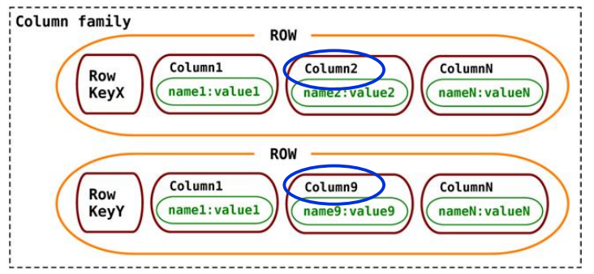

## Vhodna vyuziti

- ### Event logging

- ### CMS, Blogy

## Nevhodna vyuziti

- ### Systemy vyzadujici ACID vlastnosti

- ### Agregovani dat v dotazech

# Cassandra (sloupcove -> multimodel)

- Vyvinuta ve FB
- Ma vlastni query jazyk `CQL`

## Terminologie

- ### Column = zakladni jednotka

  - Name + value + timestamp
  - `name` je klic
  - `value` muze byt prazdna
  - indexace podle jmena a primary indexu = `row key`
  - Typy:
  - **Expiring** - nastaveny `TTL`
  - **Counter** - cislo inkremtenujici pri nejake udalosti
  - **Super** - seskupeni vice sloupcu pod jednou hodnotou -> dalsi uroven hierarchie

    - Priklad Super sloupce:

    | Row Key (Customer ID) | Super Column (Order ID) | Columns (Order Details)          |
    | --------------------- | ----------------------- | -------------------------------- |
    | `123`                 | `Order_001`             | `date: 2024-12-01`, `total: $50` |
    |                       | `Order_002`             | `date: 2024-12-05`, `total: $75` |
    | `456`                 | `Order_001`             | `date: 2024-11-30`, `total: $30` |

- ### Row = kolekce sloupcu spojenych ke klici
- ### Column family = kolekce podobnych `rows`
  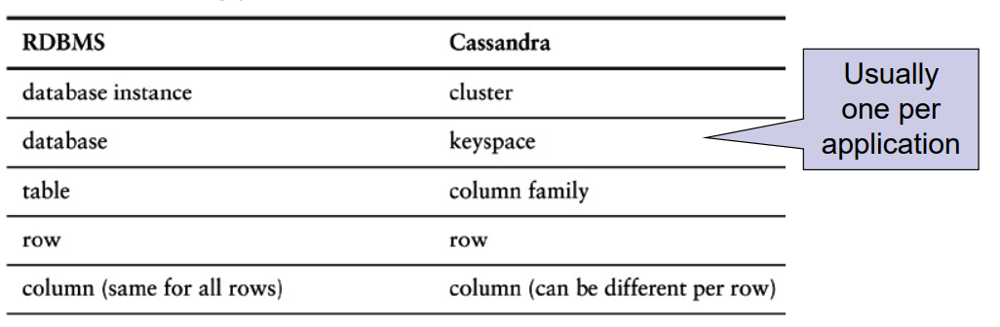

## Column families

- musime specifikovat `key`
- `Comparator` = datovy typ pro jmenou sloupce
- `Validator` = datovy typ pro hodnotu sloupce

### Staticke

- jako tabulka v relacni db
- vsechny radky maji stejnou sadu sloupcu
- povolujeme null -> kazdy sloupec nemusi mit hodnotu

### Dynamicke

- dynamicky generovane sloupce
- ulozena v jednom radku pro efektivni ziskani dat
- v tomto kontextu je `row` neco jako snapshost dat / materialiaovany `view` -> efektivnejsi

## Typy kolekci v CQL

- `set` - mnozina -> jedinecne hodnoty, vraci v abecednim poradi
- `list` -> serazene a vraci podle indexu
- `map` -> name + value pary

## CQL - Cassandra query language

### **1. Operace s Keyspace**

#### **Vytvoření keyspace**

```sql
CREATE KEYSPACE Excelsior
WITH replication = {
  'class': 'SimpleStrategy',
  'replication_factor': 3
};
```

- Definuje **keyspace** s replikací typu `SimpleStrategy` a faktorem replikace `3`.

---

#### **Použití keyspace**

```sql
USE Excelsior;
```

- Nastaví `Excelsior` jako aktuálně používaný keyspace.

---

#### **Úprava keyspace**

```sql
ALTER KEYSPACE Excelsior
WITH replication = {
  'class': 'SimpleStrategy',
  'replication_factor': 4
};
```

- Změní faktor replikace u existujícího keyspace.

---

#### **Odstranění keyspace**

```sql
DROP KEYSPACE Excelsior;
```

- Smaže keyspace a všechna data v něm.

---

### **2. Operace s tabulkami**

#### **Vytvoření tabulky s primárním klíčem**

```sql
CREATE TABLE timeline (
  userid uuid,
  posted_month int,
  posted_time uuid,
  body text,
  posted_by text,
  PRIMARY KEY (userid, posted_month, posted_time)
) WITH compaction = { 'class': 'LeveledCompactionStrategy' };
```

- **Primární klíč:**
  - `userid` je **partition key** (hlavní klíč, který určuje rozdělení dat mezi uzly).
  - `posted_month` a `posted_time` jsou **clustering columns** (určují pořadí dat uvnitř partice).
- **Strategie komprese:** Nastavena na `LeveledCompactionStrategy`.

---

#### **Smazání tabulky**

```sql
DROP TABLE timeline;
```

- Smaže tabulku a všechna její data.

---

#### **Vymazání dat z tabulky**

```sql
TRUNCATE timeline;
```

- Odstraní všechna data z tabulky, ale zachová její strukturu.

---

#### **Vytvoření indexu**

```sql
CREATE INDEX userIndex ON timeline (posted_by);
```

- Vytvoří sekundární index na sloupci `posted_by` pro efektivní dotazování mimo primární klíč.

---

#### **Smazání indexu**

```sql
DROP INDEX userIndex;
```

- Smaže vytvořený index.

---

### **3. Expirace dat v tabulce**

#### **Vytvoření tabulky**

```sql
CREATE TABLE excelsior.clicks (
  userid uuid,
  url text,
  date timestamp,
  name text,
  PRIMARY KEY (userid, url)
);
```

#### **Vložení dat s TTL (Time-To-Live)**

```sql
INSERT INTO excelsior.clicks (userid, url, date, name)
VALUES (
  3715e600-2eb0-11e2-81c1-0800200c9a66,
  'http://apache.org',
  '2013-10-09',
  'Mary'
) USING TTL 86400;
```

- Data budou automaticky smazána po 86,400 sekundách (1 den).

#### **Zjištění zbývající doby života dat**

```sql
SELECT TTL(name) FROM excelsior.clicks
WHERE url = 'http://apache.org' ALLOW FILTERING;
```

- Určuje, kolik času zbývá, než data vyprší.

---

### **4. Práce s kolekcemi**

#### **Set (množina)**

```sql
CREATE TABLE users (
  user_id text PRIMARY KEY,
  first_name text,
  last_name text,
  emails set<text>
);

INSERT INTO users (user_id, first_name, last_name, emails)
VALUES ('frodo', 'Frodo', 'Baggins', {'f@baggins.com', 'baggins@gmail.com'});

UPDATE users SET emails = emails + {'fb@friendsofmordor.org'}
WHERE user_id = 'frodo';

SELECT user_id, emails FROM users WHERE user_id = 'frodo';

UPDATE users SET emails = emails - {'fb@friendsofmordor.org'}
WHERE user_id = 'frodo';

UPDATE users SET emails = {} WHERE user_id = 'frodo';
```

- **Set** ukládá jedinečné hodnoty.
- Přidávání: `+`.
- Odebírání: `-`.
- Vymazání všech hodnot: nastavení na `{}`.

---

#### **List (seznam)**

```sql
ALTER TABLE users ADD top_places list<text>;

UPDATE users SET top_places = ['rivendell', 'rohan']
WHERE user_id = 'frodo';

UPDATE users SET top_places = ['the shire'] + top_places
WHERE user_id = 'frodo';

UPDATE users SET top_places = top_places + ['mordor']
WHERE user_id = 'frodo';

UPDATE users SET top_places[2] = 'riddermark'
WHERE user_id = 'frodo';

DELETE top_places[3] FROM users WHERE user_id = 'frodo';

UPDATE users SET top_places = top_places - ['riddermark']
WHERE user_id = 'frodo';
```

- **List** je uspořádaný seznam hodnot.
- Přidávání na začátek: `['value'] + list`.
- Přidávání na konec: `list + ['value']`.
- Přepis hodnoty podle indexu: `top_places[index]`.

---

#### **Map (mapa)**

```sql
ALTER TABLE users ADD todo map<timestamp, text>;

UPDATE users SET todo = {
  '2012-9-24': 'enter mordor',
  '2012-10-2 12:00': 'throw ring into mount doom'
}
WHERE user_id = 'frodo';

UPDATE users SET todo['2012-10-2 12:00'] =
'throw my precious into mount doom'
WHERE user_id = 'frodo';

DELETE todo['2012-9-24'] FROM users WHERE user_id = 'frodo';
```

- **Map** ukládá páry klíč-hodnota.
- Přidávání/aktualizace hodnot: `todo['key'] = 'value'`.
- Smazání hodnoty podle klíče: `DELETE todo['key']`.

## **Dotazy v Cassandře**

- Cassandra nepodporuje **joins** ani složité podmínky.
- Dotazy jsou optimalizované pro rychlé čtení jednoduchých dat.
- **Primární klíč** hraje klíčovou roli při určování výkonu dotazů.

---

### **1. Základní SELECT dotaz**

```sql
SELECT * FROM users
WHERE firstname = 'Jane' AND lastname = 'Smith'
ALLOW FILTERING;
```

- Používá **WHERE** pro filtrování výsledků.
- **ALLOW FILTERING** umožňuje filtrovat výsledky mimo primární klíč, ale může mít negativní dopad na výkon.

---

### **2. Filtrování (WHERE)**

```sql
SELECT * FROM emp
WHERE empID IN (130, 104);
```

- **IN** umožňuje vybírat více hodnot.

---

### **3. Řazení (ORDER BY)**

```sql
SELECT * FROM emp
WHERE deptID = 10
ORDER BY empID DESC;
```

- Řazení lze použít pouze u **clustering columns**.
- Směr řazení: `ASC` (výchozí) nebo `DESC`.

---

### **4. Syntaxe SELECT dotazů**

```sql
SELECT select_expression
FROM keyspace_name.table_name
WHERE relation AND relation ...
GROUP BY columns
ORDER BY clustering_key (ASC | DESC)
LIMIT n
ALLOW FILTERING;
```

- **`select_expression`**:
  - Výběr sloupců (např. `firstname, lastname`).
  - **DISTINCT**: Používá se pro jedinečné hodnoty v rámci partice.
  - **COUNT**: Spočítá řádky.
  - **Aliases**: Pomocí `AS` lze přejmenovat sloupce.
  - **TTL(column_name)**: Ukáže zbývající čas života hodnoty.
  - **WRITETIME(column_name)**: Zobrazí čas posledního zápisu hodnoty.

---

### **5. Podmínky (relation)**

- Základní podmínky:
  ```sql
  column_name ( = | < | > | <= | >= ) value
  ```
- Použití seznamů:
  ```sql
  column_name IN (value1, value2, ...)
  ```
- Použití **TOKEN**:
  ```sql
  TOKEN(column_name) ( = | < | > | <= | >= )
  ```

---

### **6. GROUP BY**

```sql
SELECT country, COUNT(*)
FROM users
GROUP BY country;
```

- **Skupinování řádků** podle sloupců.
- Povolené pouze pro sloupce obsažené v **primárním klíči**.
- Použitelné agregační funkce:
  - **COUNT, MIN, MAX, SUM, AVG**.
  - Uživatel může definovat i vlastní agregační funkce.

---

### **7. ALLOW FILTERING**

- Cassandra vyžaduje, aby dotazy byly **predikovatelné** a efektivní.
- **ALLOW FILTERING**:
  - Umožňuje spustit drahé dotazy, které filtrují velké množství dat.
  - Může být kombinováno s **LIMIT** pro omezení počtu vrácených řádků.

**Příklad:**

```sql
SELECT * FROM users
WHERE birth_year = 1981
ALLOW FILTERING;
```

- Použití filtru na sloupec, který není součástí primárního klíče.

---

### **8. Vytvoření indexu**

```sql
CREATE INDEX ON users(birth_year);
```

- Index umožňuje efektivní dotazování na sloupce mimo primární klíč.
- Použití s indexem:

```sql
SELECT firstname, lastname
FROM users
WHERE birth_year = 1981;
```

---

### **Příklady dotazů:**

#### **Výběr všech uživatelů:**

```sql
SELECT * FROM users;
```

#### **Vyhledání uživatele podle primárního klíče:**

```sql
SELECT * FROM users
WHERE username = 'frodo';
```

#### **Filtrování s řazením:**

```sql
SELECT firstname, lastname
FROM users
WHERE birth_year = 1981
ORDER BY lastname ASC
ALLOW FILTERING;
```

## Zapisy

- zapis je atomicky na urovni radku
- Memtable a SSTable jsou udrzovany pro kazdy table

### Prubeh zapisu

1. Pri zapisu jsou data ulozena v pameti -> `memtable`
2. Zapis je pridan do `commit logu` na disku (durability)
3. Memtable je flushed do `SSTable` (= sorted string table) na disku
4. Data v commit logu jsou `purged` (= odstranena) po flushnuti jejich odpovidajicich dat z `memtable` do `SSTable`

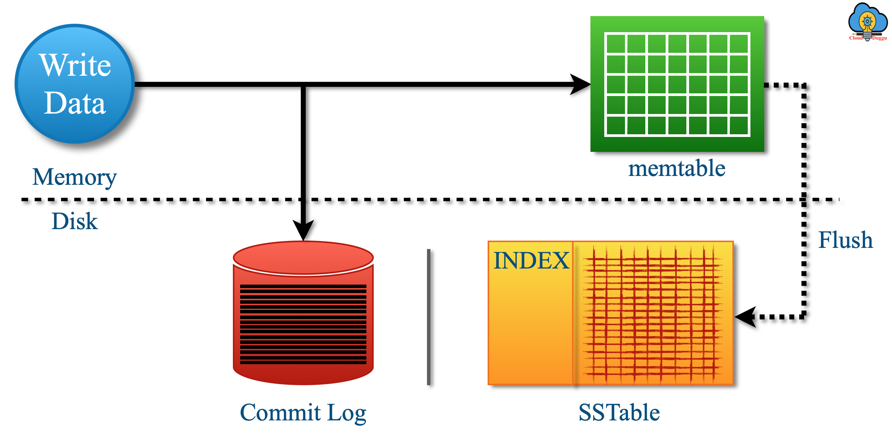

### SSTable

- = Sorted string table
- `SSTable` je immutable
  - radek je zapsan pres vice `SSTable souboru`
- read kombinuje fragmenty z `SSTable` a neflushnutych `Memtablu`
- kazdy SSTable si udrzuje:
  - `partition index` -> lokalizace dat
  - `partition summary` -> vice rozseka

### Write Request

- request zpracovava jakykoliv uzel -> stava se z nej `coordinator`
  - komunikuje mezi klientem a ostatnimi uzly s replikami
  - posle write request vsem replikam, ktere maji radek, ktery se ma zapsat
- `Write consistency level` = kolik replik musi uspet
  - uspech = data jsou zapsana do commit logu a memtablu

## Cteni

- typy read requestu:
  - primy read reqeust
  - background read repair request

### Prubeh cteni v Cassandre:

1. **Koordinátor kontaktuje repliky podle úrovně konzistence.**

   - Např. `ONE`, `QUORUM`, nebo `ALL`.
   - Vybere nejrychleji odpovídající repliky.

2. **Porovnání dat z replik.**

   - Pokud jsou konzistentní, vrátí se klientovi.
   - Pokud jsou nekonzistentní, použije se nejnovější hodnota podle **timestampu**.

3. **Read Repair (oprava čtení):**
   - Na pozadí koordinátor zkontroluje zbývající repliky.
   - Opraví zastaralé nebo nekonzistentní repliky.

## Updates

- insert a update jsou stejne operace
- neprepisuje readky -> seskupuje inserty/updaty v memtable
- `Upsert` = insert nebo update podle toho, jestli data existuji
  - sloupce jsou prepsany pouze pokud jsou timestamps novejsi
  - jinak jsou updaty ukladany do noveho SSTablu
    - pak je to margnuto na pozadi behem `compaction processu`

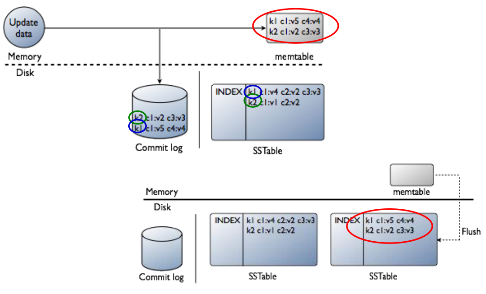

## **Deletes v Cassandře**

- **Smazání řádku:** Odpovídá smazání všech jeho sloupců.
- **Mazání není okamžité:**

### **Tombstone**

- **Definice:**

  - Značka, která označuje, že sloupec nebo řádek byl smazán.
  - Cassandra používá tombstones k opětovnému odeslání požadavku na mazání replikám, které byly při mazání nedostupné.

- **Doba platnosti tombstones:**
  - Sloupce označené tombstonem existují po **nastavitelnou dobu platnosti** (grace period).
  - Po uplynutí této doby jsou při procesu **kompakce** (compaction) trvale odstraněny.
  - Kompakce také slučuje více SSTables.

### **Možné problémy s mazáním:**

- Pokud je uzel nedostupný déle, než je nastavená grace period:
  - Může dojít k tomu, že smazaná data se na tomto uzlu objeví znovu, protože mazání nebylo na tento uzel aplikováno.

### **Řešení:**

- **Pravidelná oprava uzlů (node repair):**
  - Správci musí pravidelně spouštět opravy uzlů, aby se předešlo situacím, kdy by některé repliky měly stará data.

## Compaction process

- Cassandra **nevkládá/neupravuje/nesmaže data přímo na místě**:
  - **Vkládání/úpravy:** Vytvoří novou verzi dat s časovou značkou v nové SSTable.
  - **Mazání:** Označení dat pomocí tombstonu.
- Compaction robíhá pravidelně, aby byla data sloučena a zoptimalizována.

### Kroky Compaction

1. **Sloučení dat z SSTables** podle partition key:

   - Výběr nejaktuálnějších dat na základě timestampu.
   - Synchronizace je nutná.
   - SSTables jsou seřazené → není třeba náhodný přístup.

2. **Odstranění tombstonů a smazaných dat.**

3. **Konsolidace SSTables** do jednoho souboru.

4. **Smazání starých SSTable souborů:**
   - Jakmile všechny čekající čtení dokončí práci s těmito soubory.

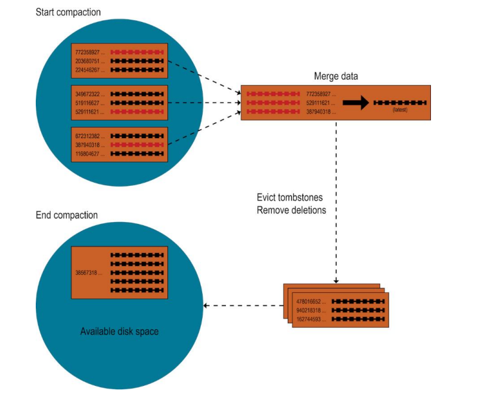

## Architektura

- peer-to-peer disribuovany system
- `Coordinator` = jakykoliv uzel zodpovedny za komunikaci s klientem

## Virtual Nodes

- kazdy uzel muze vlastnit velke mnozstvi malych partici

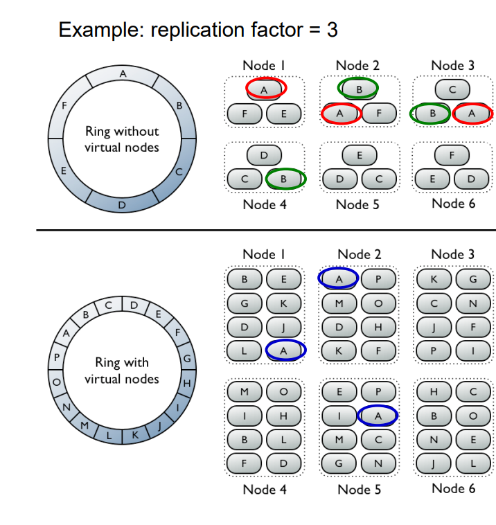

## Gossip

- bezi kazdou sekundu
- vymena info s max 3 uzly
- kazda `Gossip message` ma informace o zdroji a verzi

### Partitioner

- **Úloha:** Rozděluje data mezi uzly (včetně replik).
- **Typy:**
  - **Murmur3Partitioner (výchozí):** Uniformní distribuce pomocí MurmurHash (rychlá, nešifrovaná).
  - **RandomPartitioner:** Uniformní distribuce pomocí MD5 (dřívější výchozí).
  - **ByteOrderedPartitioner:** Řadí řádky lexikálně podle bajtů klíče, vhodné pro **ordered scans**, ale problémy s vyvažováním zátěže.

## Replikace

- Pokud je replikacni faktor prevysen, zapisy nejsou provadeny

### **Replikace**

- Pokud je replikační faktor překročen, **zápisy nejsou prováděny**.
- typicky 2-3 repliky

### **Strategie pro umístění replik**

#### **1. SimpleStrategy**

- **Vhodné pro jedno datové centrum.**
- **Pravidla:**
  1. První replika je umístěna na uzel určený partitionerem.
  2. Další repliky jsou umístěny na následující uzly ve směru hodinových ručiček v ringu.
- **Poznámka:** Uzel může patřit do datového centra a (volitelně) do racku.

#### **2. NetworkTopologyStrategy**

- **Vhodné pro více datových center.**
- **Pravidla:**
  1. První replika je umístěna podle partitioneru.
  2. Další repliky jsou umístěny:
     - **Preferenčně** na uzly v jiném racku (kvůli odolnosti proti výpadkům napájení, chlazení nebo sítě).
     - Pokud uzel v jiném racku není k dispozici, replika se umístí na jiný uzel ve stejném racku.
- **Počet replik na datové centrum je konfigurovatelný.**

## Snitch

- komponenta Cassandry informujici o sitove topologii

# Dokumentove databaze

- hodnoty jsou ukladany jako dokumenty
  - dokumenty = hierarchicke formaty XML, JSON apod.
  - hodnota zaznamu = dokument
- ocekavame podobnou strukturu dokumentu v kolekci

## Vhodna vyuziti

- ### Event logging
- ### CMS, blogy
- ### Webova analytika
- ### E-Commerce

## Nevhodna vyuziti

- ### Koplexni transakce pres vice operaci
- ### Agregovane dotazy

# MongoDB (dokumentove)

- pouziva JSON dokumenty
- podpora indexace
- mapreduce popora
- vysoka dostupnost

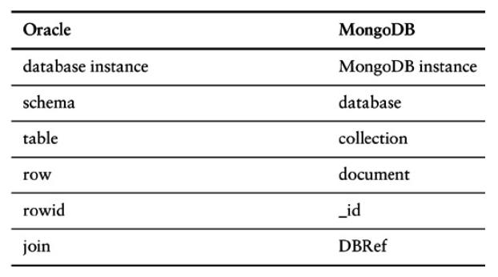

## Dokumenty v MongoDB

- vyuziva JSON
- ulozeno jako BSON - binarni JSON
- omezeni na nazvy prvku (`_id` je rezervovano, `$` nemuze byt na zacatku, `.` nesmi byt vubec)

## Datovy model

- kolekce nevynucuji strukturu dat
- dulezite rozhodnuti je zda vyuzivat reference nebo embedovat dokumenty

### Reference

- normalizovany datovy model
- reference z jednoho dokumentu na dalsi
- vice flexibility nez embedding
- ochrana proti redundanci
- nevyhodou je moznost vice roundtripu k serveru (follow up queries)

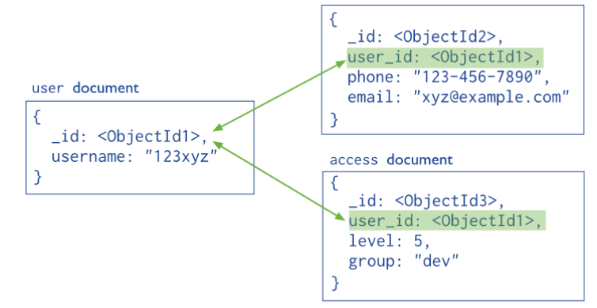

### Embedded data

- denormalizovany datovy model
- subdokumenty
- pribuzna data v jednom dokumentu
- mohou velmi narustat na velikosti

## **Prace s MongoDB**

- **Operace:** `insert`, `update`, `delete`.
  - **Kritéria:** Používají se pro výběr dokumentů, které se mají aktualizovat nebo odstranit.

---

### **Vkládání dat**

- **Vložení dokumentu:**

  ```javascript
  db.inventory.insert({ _id: 10, type: "misc", item: "card", qty: 15 });
  ```

  - Vloží dokument s uživatelem definovaným `_id`.

- **Upsert (vložení nebo aktualizace):**

  ```javascript
  db.inventory.update(
    { type: "book", item: "journal" },
    { $set: { qty: 10 } },
    { upsert: true }
  );
  ```

  - Pokud dokument neexistuje, vytvoří nový.

- **Save (vložení nebo nahrazení):**
  ```javascript
  db.inventory.save({ type: "book", item: "notebook", qty: 40 });
  ```

---

### **Mazání dat**

- **Smazání všech odpovídajících dokumentů:**
  ```javascript
  db.inventory.remove({ type: "food" });
  ```
- **Smazání jednoho dokumentu:**
  ```javascript
  db.inventory.remove({ type: "food" }, 1);
  ```

---

### **Aktualizace dat**

- **Aktualizace více dokumentů:**
  ```javascript
  db.inventory.update(
    { type: "book" },
    { $inc: { qty: -1 } },
    { multi: true }
  );
  ```
- **Nahrazení dokumentu:**
  ```javascript
  db.inventory.save({ _id: 10, type: "misc", item: "placard" });
  ```

---

### **Dotazy**

- **Základní dotazy:**

  - Všechny dokumenty:
    ```javascript
    db.inventory.find({});
    ```
  - Dokumenty, kde `type = "snacks"`:
    ```javascript
    db.inventory.find({ type: "snacks" });
    ```
  - Dokumenty s hodnotou v poli `type` buď `"food"` nebo `"snacks"`:
    ```javascript
    db.inventory.find({ type: { $in: ["food", "snacks"] } });
    ```

- **Logické operátory:**
  - Dokumenty, kde `qty > 100` nebo `price < 9.95`:
    ```javascript
    db.inventory.find({
      $or: [
        { qty: { $gt: 100 } },
        { price: { $lt: 9.95 } }
      ]
    });
    ```

---

### **Práce s poddokumenty**

- **Dotaz na přesnou strukturu poddokumentu:**
  ```javascript
  db.inventory.find({
    producer: {
      company: "ABC123",
      address: "123 Street"
    }
  });
  ```
- **Dotaz na konkrétní pole v poddokumentu:**
  ```javascript
  db.inventory.find({ "producer.company": "ABC123" });
  ```

---

### **Práce s poli**

- **Pole s přesnou hodnotou a pořadím:**
  ```javascript
  db.inventory.find({ tags: ["fruit", "food", "citrus"] });
  ```
- **Pole obsahující prvek:**
  ```javascript
  db.inventory.find({ tags: "fruit" });
  ```

---

### **Omezení a třídění výsledků**

- **Omezení polí výsledku:**

  - Pouze `item` a `qty`:
    ```javascript
    db.inventory.find({ type: "food" }, { item: 1, qty: 1 });
    ```
  - Vyloučení pole `type`:
    ```javascript
    db.inventory.find({ type: "food" }, { type: 0 });
    ```

- **Třídění:**
  - Podle `age` sestupně:
    ```javascript
    db.collection.find().sort({ age: -1 });
    ```
  - Podle `last` a následně `first` vzestupně:
    ```javascript
    db.bios.find().sort({ "name.last": 1, "name.first": 1 });
    ```

### **Vyuziti indexu**

- **Bez indexů:**
  - MongoDB musí skenovat každý dokument v kolekci, aby našla odpovídající dokumenty.
- **Indexy:**
  - Ukládají část dat kolekce v snadno prohledávatelné formě.
  - Hodnoty konkrétních polí (nebo sad polí) jsou ukládány a tříděny.
  - Používají struktury podobné **B-stromům**.
- **Účel:**
  - Zrychlení běžných dotazů.
  - Optimalizace výkonu v konkrétních situacích.

---

### **Použití indexů**

1. **Pro tříděné výsledky:**

   - MongoDB traversuje index přímo (vzestupně/sestupně), aniž by musela data třídit.
   - Data mimo index se nekontrolují.

2. **Pro pokryté výsledky:**
   - Pokud index obsahuje všechna pole potřebná pro dotaz, MongoDB vrátí výsledky pouze z indexu, což zrychlí dotaz.

## 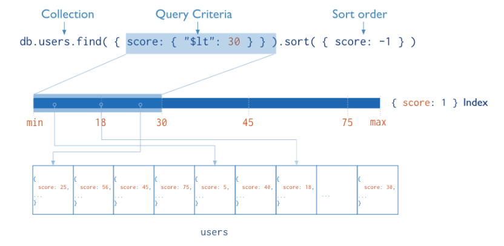

### **Typy indexů**

1. **Výchozí `_id`:**

   - Automaticky vytvořený.
   - Unikátní.

2. **Jednopolní indexy:**

   - Uživatelem definované na jednom poli dokumentu.

   ```javascript
   db.people.ensureIndex({ "phone-number": 1 });
   ```

3. **Složené indexy (Compound):**

   - Uživatelem definované na více polích.

   ```javascript
   db.products.ensureIndex({ item: 1, category: 1, price: 1 });
   ```

4. **Multikey indexy:**

   - Indexují obsah uložený v polích typu pole.
   - Vytváří samostatné indexové záznamy pro každý prvek pole.

   ```javascript
   db.collection.ensureIndex({ "tags": 1 });
   ```

5. **Geoprostorové indexy:**

   - **2d indexy:** Pro data na dvourozměrné rovině.
   - **2sphere indexy:** Pro data reprezentující zeměpisnou délku a šířku.

6. **Textové indexy:**

   - Pro hledání textového obsahu v kolekci.

7. **Hash indexy:**
   - Indexuje hash hodnoty pole.
   - Podporuje pouze rovnostní dotazy, ne rozsahové.

---

### **Příklady**

- **Jednopolní index:**
  ```javascript
  db.people.ensureIndex({ "phone-number": 1 });
  ```
- **Složený index:**
  ```javascript
  db.products.ensureIndex({ item: 1, category: 1, price: 1 });
  ```
- **Unikátní index:**
  ```javascript
  db.accounts.ensureIndex({ "tax-id": 1 }, { unique: true });
  ```
- **Hash index:**
  ```javascript
  db.collection.ensureIndex({ _id: "hashed" });
  ```

## Replikace

- master/slave
- `replica set` = skupina instanci hostujici stejny dataset (kazdy ma svoji kopii)

### Primarni uzel

- master
- prijima vsechny write operace
- zapisuje do `oplogu`

### Sekundarni uzly

- slave
- cte z `oplogu` mastera
- aplikauje operace z oplogu ve stejenm poradi pro udrzeni aktualnich dat
- muzeme ho dale nastavit:
  - `Priority 0` - nemuze byt primary ve volbacj
  - `Hidden` - nelze z nej cist
  - `Delayed` - bezi na nem historicka data, napr. z duvodu recovery

### **Zápis**

1. MongoDB aplikuje zapisovací operace na **primární uzel** (primary).
2. Operace jsou zaznamenány do **oplogu primárního uzlu**.
3. Sekundární uzly (secondary members):
   - Replikují obsah oplogu.
   - Aplikují operace z oplogu na svá data, aby byla aktuální.

---

### **Čtení**

1. **Všichni členové replica setu** mohou přijímat požadavky na čtení.
2. **Výchozí chování:**

   - Aplikace směruje čtení na **primární uzel**.
   - Zaručuje, že čtení vrací nejaktuálnější verzi dokumentu.
   - Snižuje propustnost pro čtení na sekundárních uzlech.

3. **Read preference mode:**
   - Lze nastavit, aby čtení probíhalo také ze sekundárních uzlů.
   - Například:
     - **primaryPreferred:** Primární uzel je preferován, ale sekundární uzly jsou použity, pokud primární není dostupný.
     - **secondary:** Čtení probíhá pouze ze sekundárních uzlů.

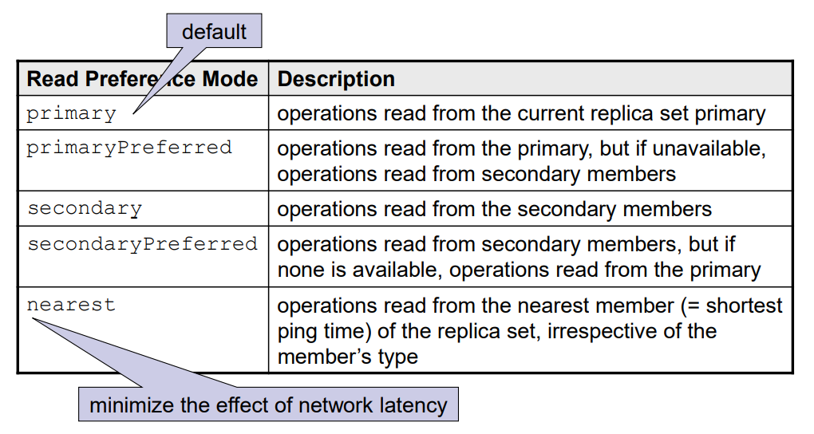

## **Replica Set Elections v MongoDB**

### **Principy voleb**

1. **Primární uzel:**

   - V replica setu může být **maximálně jeden primární uzel**.
   - Pokud primární uzel není dostupný, proběhne volba nového primárního uzlu.

2. **Trvání voleb:**
   - Volba obvykle trvá přibližně **1 minutu**.
   - Během této doby není k dispozici žádný primární uzel → nejsou možné zápisy.

---

### **Faktory ovlivňující volby**

1. **Heartbeat (ping):**

   - Uzel posílá heartbeat ostatním každé **2 sekundy**.
   - Pokud odpověď nepřijde do **10 sekund**, uzel je považován za nedostupný.

2. **Priority uzlů:**

   - Uzel s vyšší prioritou má přednost při volbě primárního uzlu.
   - **Priority = 0:**
     - Uzel nemůže být primární.
     - Nemůže zahájit volbu, ale může hlasovat.
   - Aktuální primární uzel:
     - Musí být v **souladu s nejnovějším oplogem** do **10 sekund**.
   - Sekundární uzel s vyšší prioritou:
     - Pokud dožene synchronizaci do **10 sekund**, může vyvolat volbu.

3. **Spojení:**
   - Uzel může být zvolen primárním pouze tehdy, pokud je připojen k **většině členů** replica setu.

---

### **Mechanismus voleb**

1. **Volby se spustí, když:**

   - Replica set je inicializován.
   - Sekundární uzel ztratí kontakt s primárním.
   - Primární uzel "ustoupí" (step down) nebo ztratí spojení s většinou členů.

2. **Primární uzel se vzdá role:**

   - Po obdržení příkazu `replSetStepDown`.
   - Pokud má sekundární uzel vyšší prioritu.
   - Pokud nemůže kontaktovat většinu členů replica setu.

3. **Volba nového primárního uzlu:**
   - Člen s **nejvyšší prioritou**, který je aktuální, se stane kandidátem.
   - První člen, který získá **většinu hlasů**, je zvolen primárním.

---

### **Speciální případy:**

1. **Nehlasující členové (non-voting members):**

   - Mají kopii dat, ale nemohou hlasovat.
   - Mohou být zvoleni primárním, ale toto nastavení není doporučeno.

2. **Veto členů:**
   - Každý člen může volbu vetovat, pokud:
     - Kandidát není synchronizován s nejnovější operací v replica setu.
     - Kandidát má nižší prioritu než jiný oprávněný člen.

## Arbiter

- specialni uzel
- neuchovava dataset
- nemuze byt primary
- je pouze pro hlasovani ve volbach (pro repliky se sudym poctem hlasujicich)

## Sharding

### **Sharded Clusters v MongoDB**

- **Složení:**
  1. **Shards:** Uchovávají data.
     - Každý shard je replica set.
  2. **Query Routers:** Rozhraní pro klientské aplikace.
     - Routují operace na správné shard(y) a vracejí výsledky.
     - Více routerů pro rozložení zátěže.
  3. **Config Servers:** Uchovávají metadata clusteru.
     - Mapují datovou sadu na shardy.
     - Doporučený počet: 3.

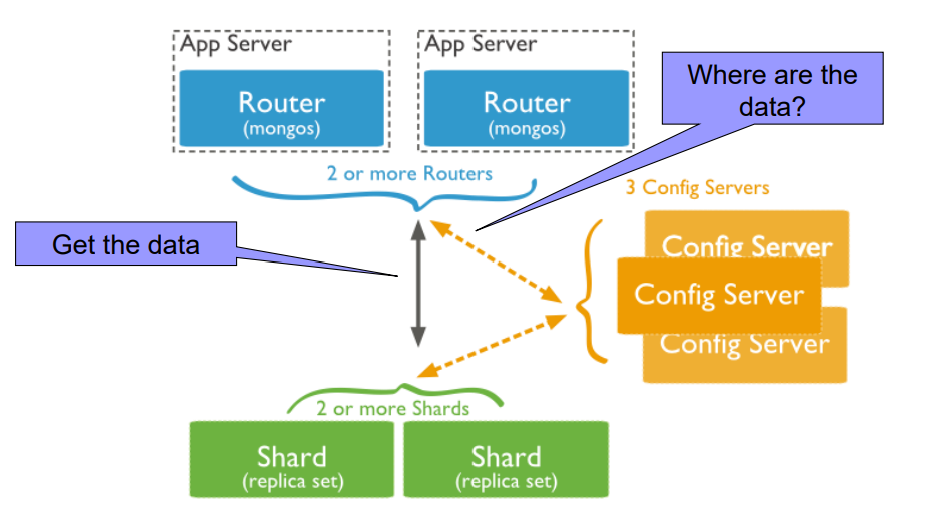

## Partitioning dat

### **Data Partitioning v MongoDB**

- **Rozdělení dat:** Data kolekce se dělí podle **shard key**.

  - **Shard key:**
    - Indexované pole (možné složené), které je přítomné v každém dokumentu.
    - **Neměnný** (immutable).
  - Data se dělí na **chuncks**, které se distribuují mezi shardy.

- **Rozdělení dat:**

  - **Range-Based Partitioning:**
    - Hodnoty shard key se rozdělí na kontinuální úseky (chunky).
    - Efektivnější pro range dotazy, ale může vést k nerovnoměrné distribuci dat.
  - **Hash-Based Partitioning:**
    - Hodnota shard key se zahashuje a výsledné hashe tvoří chunky.
    - Rovnoměrnější distribuce dat, ale range dotazy mohou zasáhnout více shardů.

- **Chunk velikost a migrace:**
  - Chunk se rozdělí, pokud přeroste nastavenou velikost (**výchozí 64MB**).
  - **Malé chunky:** Rovnoměrnější distribuce, ale častější migrace.
  - **Velké chunky:** Méně migrací, ale nerovnoměrné zatížení.

## Journaling

- **Co dělá:** Ukládá zápisové operace do paměti a journalu před aplikací na data.
- **Účel:** Obnovení konzistence databáze po tvrdém vypnutí.
- **Journal file:**
  - Append-only log (write-ahead redo log).
  - Smazán, když jsou všechny zápisy provedeny.
  - Nový soubor vytvořen při 1 GB (velikost lze upravit).
- **Clean shutdown:** Smaže všechny journal soubory.

## **Two-Phase Commit v MongoDB**

### Transakce přes více dokumentů:

- Když operace zahrnuje více dokumentů (např. změny v několika kolekcích), MongoDB podporuje multi-document transactions, které zajišťují transakční vlastnosti (ACID) pro více dokumentů najednou.

### **Co je Two-Phase Commit?**

- Proces umožňující transakce zahrnující více dokumentů s **transaction-like** vlastnostmi.
- Data jsou ukládána a spravována pomocí speciální kolekce transakcí.

---

### **Kroky Two-Phase Commit**

#### **Příklad: Převod peněz mezi účty A a B**

1. **Inicializace transakce:**

   - Vytvoříme účty:
     ```javascript
     db.accounts.save({name: "A", balance: 1000, pendingTransactions: []});
     db.accounts.save({name: "B", balance: 1000, pendingTransactions: []});
     ```
   - Vytvoříme transakci:
     ```javascript
     db.transactions.save({source: "A", destination: "B", value: 100, state: "initial"});
     ```
     - Transakce má stav `initial`.

2. **Změna stavu transakce na `pending`:**

   ```javascript
   t = db.transactions.findOne({state: "initial"});
   db.transactions.update({_id: t._id}, { $set: {state: "pending"} });
   ```

3. **Aplikace transakce na účty:**

   - Odepíšeme z účtu A a připíšeme na účet B:
     ```javascript
     db.accounts.update({ name: t.source, pendingTransactions: {$ne: t._id} },
       { $inc: {balance: -t.value}, $push: {pendingTransactions: t._id} });
     db.accounts.update({ name: t.destination, pendingTransactions: {$ne: t._id} },
       { $inc: {balance: t.value}, $push: {pendingTransactions: t._id} });
     ```

4. **Změna stavu transakce na `applied`:**

   ```javascript
   db.transactions.update({_id: t._id}, { $set: {state: "applied"} });
   ```

5. **Odstranění `pendingTransactions` z účtů:**

   ```javascript
   db.accounts.update({name: t.source}, { $pull: {pendingTransactions: t._id} });
   db.accounts.update({name: t.destination}, { $pull: {pendingTransactions: t._id} });
   ```

6. **Změna stavu transakce na `done`:**
   ```javascript
   db.transactions.update({_id: t._id}, { $set: {state: "done"} });
   ```

---

### **Řešení chyb**

- **Mezi kroky 1 a 3 (před aplikací transakce):**

  - Pokračujeme od kroku 2: nastavíme stav transakce na `pending`.

- **Mezi kroky 3 a 6 (po aplikaci transakce):**
  - Pokračujeme od kroku 5: odstraníme `pendingTransactions` a dokončíme transakci.

---

### **Rollback transakce**

1. **Nastavení stavu na `cancelling`:**

   ```javascript
   db.transactions.update({_id: t._id}, { $set: {state: "cancelling"} });
   ```

2. **Vrácení změn na účtech:**

   ```javascript
   db.accounts.update({name: t.source, pendingTransactions: t._id},
     { $inc: {balance: t.value}, $pull: {pendingTransactions: t._id} });
   db.accounts.update({name: t.destination, pendingTransactions: t._id},
     { $inc: {balance: -t.value}, $pull: {pendingTransactions: t._id} });
   ```

3. **Změna stavu na `cancelled`:**
   ```javascript
   db.transactions.update({_id: t._id}, { $set: {state: "cancelled"} });
   ```

---

### **Více aplikací a správa transakcí**

- **Požadavek:** Jen jedna aplikace může spravovat konkrétní transakci.
- **Řešení:** Použití metody `findAndModify`:
  ```javascript
  t = db.transactions.findAndModify(
    {query: {state: "initial", application: {$exists: false}},
     update: {$set: {state: "pending", application: "A1"}},
     new: true});
  ```
  - Tímto způsobem se transakce přiřadí konkrétní aplikaci a zajistí se atomická změna.

# Grafove databaze

- umoznuji modelovat komplexni vztahy mezi objekty
- vztahy jsou persistentni a nejsou vypocteny behem dotazu narozdil od relacnnich dbs

# Neo4J (grafove)

- ma plne ACID vlastnosti
- otpimalizovana pro propojena data

## Principy

- zakladni jednotkou je uzel + vztahy
- uzly a vztahy mohou obsahovat vlastnosti (key/value pary)
- vztahy jsou orientovane
- uzly mohou mit labels
- hrany mohou byt typovane

## **Traversal Framework v Neo4j - Výpis**

- **Projití grafem:** Navštívení uzlů a hran podle stanovených pravidel.

### **Klíčové komponenty traversal frameworku:**

1. **Expanders:**

   - Definují, co se bude procházet (např. směr a typ relací).

2. **Order:**

   - Pořadí průchodu:
     - **Depth-first (DFS):** Do hloubky.
     - **Breadth-first (BFS):** Do šířky.

3. **Uniqueness:**

   - Zajišťuje, že uzly, relace nebo cesty jsou navštíveny pouze jednou.

4. **Evaluator:**

   - Rozhoduje, co se má vrátit a zda pokračovat v průchodu za aktuální pozici.

5. **Startovací uzly:**
   - Uzly, kde průchod grafem začíná.

## Gremlin

- jazek pro graph traversal
- open source, vyvijen TinkerPopem
- skripty bezi na serveru db

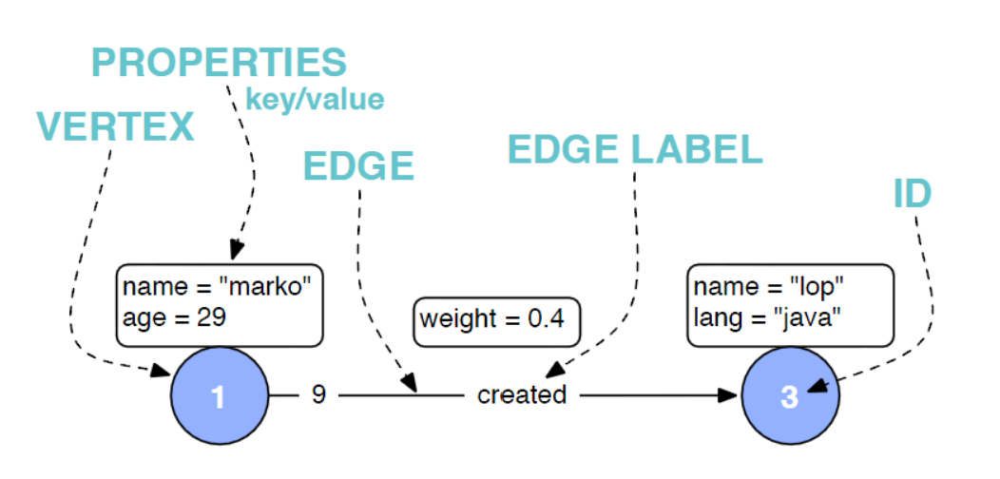

## Cypher

- grafovy dotazovaci jazyk pro Neo4J
- dotazy a updaty
- narozdil od Gremlinu je deklarativni -> popiseme, co chceme a ne jak to chceme ziskat

### **Klauzule Cypher**

1. **START:** Výchozí body v grafu (indexy, IDs).
2. **MATCH:** Grafový vzor k nalezení, navázaný na výchozí body.
3. **WHERE:** Kritéria filtrace.
4. **RETURN:** Co se má vrátit.
5. **CREATE:** Vytvoření uzlů a vztahů.
6. **DELETE:** Odstranění uzlů, vztahů a vlastností.
7. **SET:** Nastavení hodnot vlastností.
8. **FOREACH:** Akce na každém prvku seznamu.
9. **WITH:** Rozdělení dotazu na více částí.

---

### **Příklady dotazů**

1. **Vytvoření uzlů:**

   ```cypher
   CREATE (n);
   CREATE (a {name: 'Andres'}) RETURN a;
   ```

2. **Vytvoření vztahů:**

   ```cypher
   MATCH (a {name: "Andres"})
   CREATE (a)-[r:FRIEND]->(b {name: "Jana"}) RETURN r;
   ```

3. **Vytvoření cesty:**

   ```cypher
   CREATE p = (andres {name:'Andres'})-[:WORKS_AT]->(neo)<-[:WORKS_AT]-(michael {name:'Michael'})
   RETURN p;
   ```

4. **Změna vlastností:**

   ```cypher
   MATCH (n { name: 'Andres' })
   SET n.surname = 'Taylor' RETURN n;
   ```

5. **Smazání:**

   ```cypher
   MATCH (n { name: 'Andres' }) DETACH DELETE n;
   ```

6. **FOREACH:**

   ```cypher
   MATCH p =(begin)-[*]->(END)
   WHERE begin.name = 'A' AND END.name = 'D'
   FOREACH (n IN nodes(p)| SET n.marked = TRUE);
   ```

7. **Dotazování:**

   ```cypher
   MATCH (john {name: 'John'})-[:friend]->()-[:friend]->(fof)
   RETURN john.name, fof.name;
   ```

8. **Řazení:**

   ```cypher
   MATCH (n)
   RETURN n.name, n.age
   ORDER BY n.name;
   ```

9. **Počet vztahů:**
   ```cypher
   MATCH (n { name: 'A' })-[r]->()
   RETURN type(r), count(*);
   ```

---

### **Další funkce a operátory**

- **Agregace:**
  - `COUNT`, `SUM`, `AVG`, `MAX`, `MIN`.
- **LIMIT a SKIP:**
  - Omezení vrácených výsledků (`LIMIT n`).
  - Přeskočení prvních výsledků (`SKIP n`).
- **Predikáty:**
  - `ALL`, `ANY`.
- **Funkce:**
  - Délka cesty (`LENGTH`), typ vztahu (`TYPE`), ID uzlu/vztahu (`ID`).
- **Operátory:**
  - Výkonné nástroje pro práci s daty v grafech.

## Mnagamenet transakci

- neo4j ma podporu ACID vlastnosti
- vsechny zapisy v grafu musi byt provedeny v transakci
  - tohle se resi zanorenymi transakcemi
- **Kroky transakce:**

1. Zacit transakci
2. Prace s grafem a write operacemi
3. Oznaceni transakce za uspesnou nebo ne
4. Konec transakce -> pamet a zamky vypusteny

## **Čtení (Read)**

- **Výchozí chování:**
  - Čtení vrací poslední potvrzenou hodnotu.
  - **Čtení neblokuje ani nezamyká**.
- **Vyšší úroveň izolace:**
  - **Zámky pro čtení** lze explicitně získat, pokud je potřeba zamezit změnám.

---

## **Zápis (Write)**

- **Zpracování:**
  - Všechny úpravy v rámci transakce se uchovávají v paměti.
  - Velké aktualizace musí být rozděleny na menší části.
- **Výchozí zamykání:**
  - **Vlastnosti uzlů/vztahů:**
    - Při přidání, změně nebo odstranění se zamkne daný uzel/vztah.
  - **Vytvoření nebo smazání uzlu:**
    - Zápisový zámek na konkrétní uzel.
  - **Vytvoření nebo smazání vztahu:**
    - Zámek na vztah a jeho propojené uzly.

---

## **Smazání (Delete)**

- **Chování:**
  - Při smazání uzlu/vztahu jsou odstraněny i všechny jeho vlastnosti.
- **Vztahy připojené k uzlu:**
  - Pokud jsou k uzlu připojeny vztahy, budou smazány také.

## Indexace

- maji jedinecne, uzivatelem specifikovane jmeno
- indexovat lze uzly a vztahy

## Automaticka indexace

- jeden automaticky index pro uzly a jeden pro vztahy
  - defaultne vypnuto

## High availability

- transakce jsou atomicke, isolovane, durable, ale pro `C` jsou eventualne propagovane slavum
- umoznuje fault-tolerantni databazi
- muzeme nakonfigurovat nektere ze slavu jako presne repliky specificke neo4j master databaze
- umoznuje read-mostly architekturu
- vzdy jeden master a zadni nebo vice slavu
- pri startupu se neo4j db instance snazi napojit ke clusteru
  - pokud cluster existuje, stane se slavem
  - jinak se stava masterem

### Zapis na masterovi

- je eventelne propagon do slavu

### Zapis na slavovi

- je ihned synced s masterem
- operace je provedena u slava a taky u mastera

## Data na disku

- linked list zaznamu
- properties = linked list property zaznamu
  - key + value + ref na dalsi vlastnost

# Multimodel databaze

- u big data prichazi problem s Variety
- podpora vice datovych modelu v jednom integrovanem BE
- zaklady lezi v ORDMBS -> ORM
- Vyhody:
  - jeden system na vsechna data
  - konzistence
  - sjednodena query language
- Nevyhody:
  - komplexni
  - nezrale a stale ve vyvoji
- Priklady: ArangoDB, OrientDB

## Polyglotni persistence

- idea: pouzit sparvny nastroj pro dany ukol
- pro nejaka data tedy vyuzijeme grafovou db, pro jina key/value apod.
- Vyhody:
  - multi model data jsou uchovany
  - dobra skalovatelnost
- Nevyhody:
  - integrace vsech ruznych db
  - cross model dotazy a transakce

## ArangoDB (dokumentova -> multimodel)

- dokumenty, grafy, key/value
- uklada vsechna data jako dokumenty

## OrientDB (grafova -> multimodel)

- dokumentovy, grafy, key/value, objekty
- vztahy jsou reseny jako v grafovych db s hranami mezi zaznamy
- dotazy v SQL pro rozsireny graph traversal

## Techniky rozsireni k multimodelu

- nejvice typ multimodel dbs jsou relacni

### **Typy strategií:**

1. **Nová strategie ukládání prizpusobena novemu modelu**

2. **Rozšíření původní strategie:**

   - Přidání podpory pro nový model (např. ArangoDB - speciální edge kolekce pro grafy).

3. **Nové rozhraní pro původní strategii**

4. **Beze změny původní strategie:**
   - Data jednoduššího formátu než původní model jsou ukládána a zpracovávána bez změn.

### **Typy přechodů mezi modely:**

- **Inter-model references:** Odkazy mezi modely.
- **Model embedding:** Vnoření jednoho modelu do druhého.
- **Cross-model redundancy:** Redundance dat mezi modely.

## Zpracovavani multimodel dotazu

- typicky chceme stavet na uz funkcnim dotazovacim systemu
- optimalizace dotazu probiha nejcasteji pomoci B-tree/B+-tree indexu

## Vyzvy mutlimodel databazi

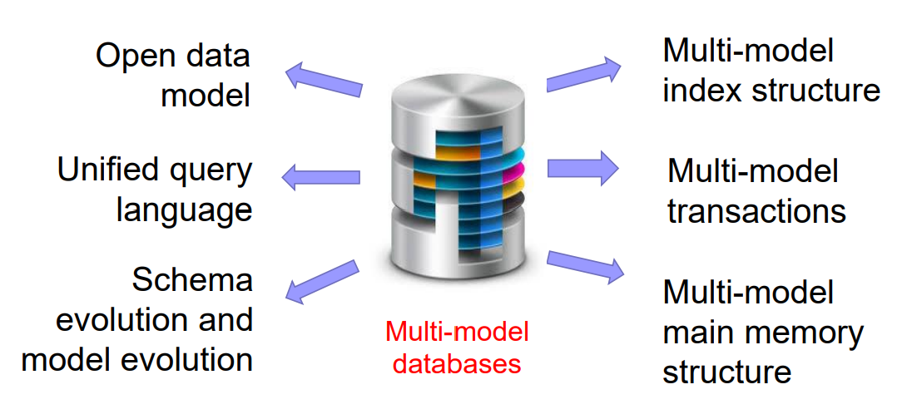

# Polystores

- slozitym problemem je **variety** -> motivuje multimodel dbs a polystores
- propojuje vice technologii pro ukladani dat -> vybirama na zaklade vyuziti aplikaci
- vyuzivaji nejvhodnejsi nastroje pro kazdy dilci ukol

## Vyhody a nevyhody

### Vyhody

- dobra skalovatelnost
- prenositelne znalosti ze single modelu

### Nevyhody

- nutnost specialistu pro integraci ruznych dbs
- cross-model dotazy a transakce

## Typy Polystoru

1. **Loosely-coupled**

   - Podobné architektuře **mediator-wrapper**.
   - kazda db ma svuj **wrapper**
   - query procesor preda wrapperu cast query ke zpracovani
   - Používají **jeden spolecny interface**
   - jednotlive dbs maji svoji autonomii (dostanou primo cast query, ale sami si ji pak pro sebe prelozi)

2. **Tightly-coupled**

   - centralni je mediator
   - Využívají přímo **lokální interface**
   - od mediatoru tedy dostane db pro sebe specificke pokyny
   - Používají **materializované views** a **indexy**

3. **Hybridy**

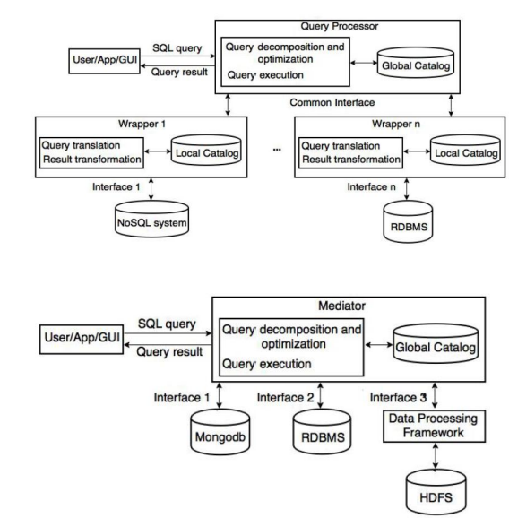

## Dimenze polystoru

### **Klíčové vlastnosti polystorů**

1. **Heterogenita:**

   - Různé datové modely, dotazovací modely, možnosti vyjádření a dotazovací enginy.

2. **Autonomie:**

   - Asociace s polystorem, podpora nativních aplikací

3. **Transparentnost:**

   - Skrytí umístění dat (i přes více úložišť) a jejich transformace/migrace

4. **Flexibilita:**

   - Uživatelsky definovaná schémata, interfacy a modularita

5. **Optimalita:**
   - plány a optimální umístění dat

## 1. Tightly integrated polystores (= TIPs)

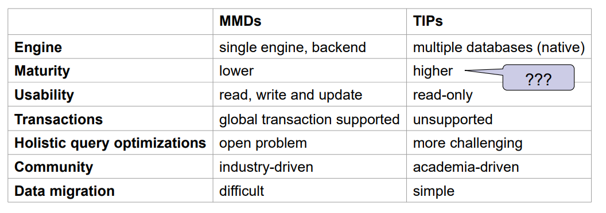
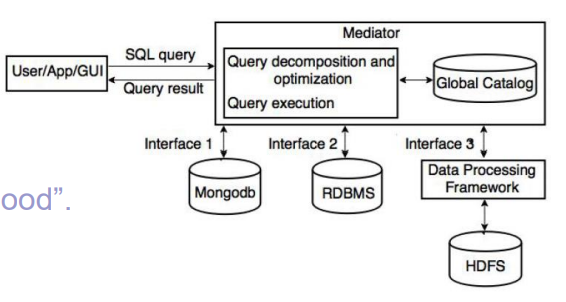

## 2. Loosely Integrated Polystores

### **Kroky**

1. Rozdělit dotaz na dílčí dotazy pro jednotlivá úložiště.
2. Odeslat dílčí dotazy wrapperům.
3. Přeložit dotazy do formátu úložišť.
4. Získat výsledky z úložišť.
5. Přeložit výsledky do společného formátu.
6. Integrovat výsledky do jednoho výstupu.

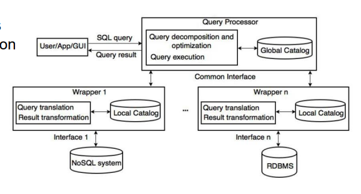

## 3. Hybridni Polystory

- vyuzivaji mediator-wrapper architekturu
- prikladem je `BigDAWG`

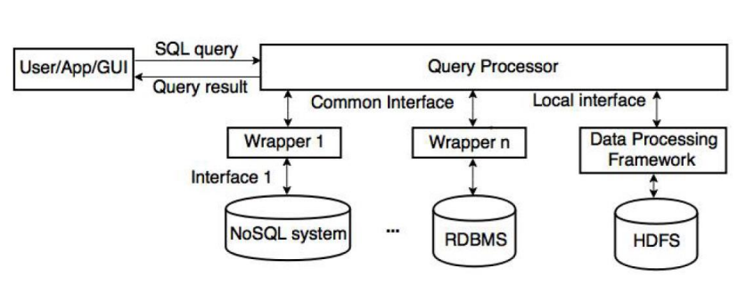

# NewSQL databaze

- novy / alternativno pristup k SQL DBMS
- **idea:** skalovatelne uloziste + funkcionalita tradicnich relacnich dbs
  - ACID vlastnosti, relacni model, SQL pristup
- napriklad realizovano cloudem: Microsoft Azure

## Motivace NewSQL

- aplikace fungujici na relacnim modelu potrebuji zachazet s neustale vetsimi daty -> nutnost skalovat
- aplikace vyzadujici silnou konzistenci a skalovatelnost

## VoltDB (NewSQL)

- z perspektivy uzivatele klasicky relacni DBMS
- shared-nothing archikektura
  - uzly v clusteru nesdili pamet, disk apod.
  - casti jsou autonomni a komunikuji skrze zpravy
- in-memory databaze -> durability je resena command logem / snapshoty

> pozorovani: tradicni databaze provadi skutecnou praci mene nez 10 % casu

# Array databaze (databaze polí)

- specificky pro data reprezentovana jako n-dimenzionalni pole

## Vhodna vyuziti

- ### Zaznamy hodnot v case
  - biologie, chemie, fyzika, geologie

# SciDB (array)

- datovy model: multidimenzionalni sorted array
- predpoklad: data nejsou prepisovana
  - update = nova verze dat
- distribuuje chunky dat

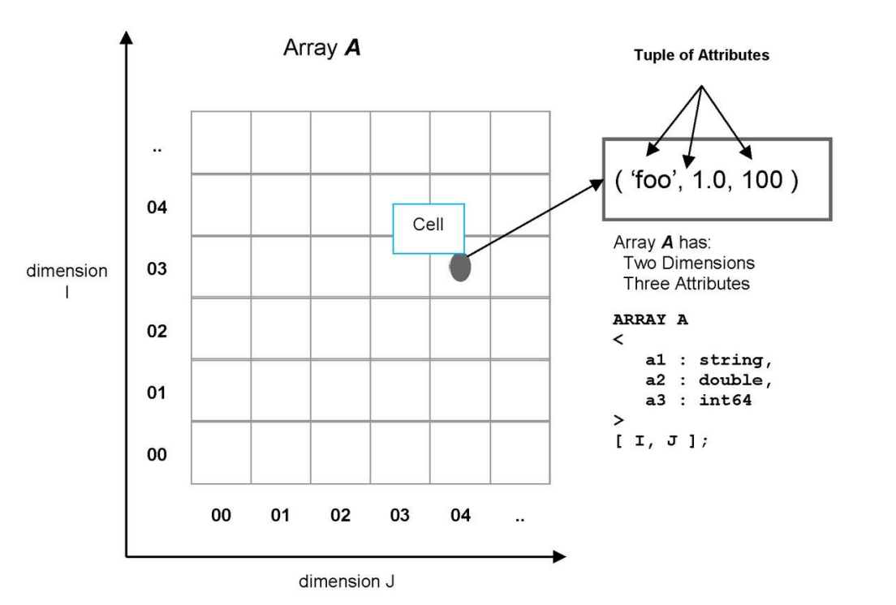

## AQL (Array Query language)

- misto tables pracujeme s arrays
- kompilovano do AFL (array functional language)

### Pole v AQL

- obsahuje jmeno a serazeny list s pojmenovanymi dimenzemi
- ma alespon jeden atribut s datovym typem
- aspon jednu dimenzi
- kazda dimenze ma:
  - souradnice (0 - 99)
- zakladni hodnotu atributu specifikujeme pomoci `missing code` (= `null` v SQL)

### Bunka v poli

- jmeno
- datovy typ
- nullability
- default value

## Vyhodnocovani dotazu

- dotaz: serie operatoru
- provadi optimalizace jako SQL v relacni algebre
  - posunuti operatoru, nahrazeni sekvence operatoru efektivnejsi apod.

## Docasna pole

- mohou zlepsit vykonost
- negaratuji ACID vlastnosti
- nejsou persistnenti (jen in memory)
- bez verzi

## Multidimensional Array Clustering

1. **Organizace dat:**

   - Data blízká v souřadnicovém systému jsou ve stejném chunku a ve stejném pořadí jako souřadnice
   - Atributy jsou ukládány odděleně

2. **Efektivní ukládání:**

   - Data v chunku jsou ukládána do souvislých bloků a komprimována
   - Souřadnice nejsou ukládány, ale vypočítávány

3. **Překrývání chunků (overlap):**
   - Překryv replikuje data do sousedních chunků
   - Zvyšuje výkon dotazů na **okna** bez potřeby speciálního programování
   - Vyžaduje více úložného prostoru, ale urychluje operace

# Search Enginy

- neni pozadavek na pevnou strukturu dat narozdil od relacnich DBMS

## Vhodna vyuziti

- ### Fulltext search
- ### Log analysis
- ### Relevance-based search

# ElasticSearch

- distribuovany full-text search engine
- HTTP web interface
- skoro real time vyhledavani

## Index

- kolekce dokumentu s podobnou charakteristikou
- vzdy pojmenovany
- indexy lze shardovat a pak replikovat

### Tvorba indexu

- definujeme pocet shardu a replik
- kazdy shard je sam o sobe funkcni index

# Transakce

- **business transakce** = serie systemovych transakci
- **offline concurrency** = manipulaci s daty a az potom je ulozime

  > Uživatel načte objednávky, upraví je lokálně a pak výsledky uloží zpět do databáze.

## Problémy


## Optimisticky offline lock

- predpoklada **nizkou sanci konfliktu**
- **Pred commitem**:
  1. Klient znovu precte data, se kterymi business transakce manipuluje
  2. Kontrola zda se prectena data nezmenila od zacatku business transakce

## Pesimisticky offline lock

- dovoluje pouze jedne business transakci pristupovat k danym datum
- nutnost uzamknout data business transakcí predtim nez je zacne pouzivat
- standartni problem: deadlock
  - muzeme resit timeout aplikace nebo timestampem locku

## Coarse-grained Lock

- pokryva vice souvisejicich zdroju najednou (skupinu)
- vhodne v moment, kdy objekty potrebujeme upravovat jako skupinu
- pro implementaci je nutny sofistikovany lock manager

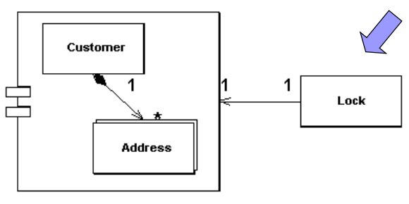

## Implicit lock

- zamky jsou ziskany automaticky aplikaci

# Performance Tuning

- MapReduce umoznuje horizontalni skalovani bez bottlenecku

## Linearni skalovatelnost

- **Předpoklad:** Úlohy lze paralelizovat do rovnoměrně rozložených jednotek.

**Typický model s horizontálním škálováním (MapReduce):**

- **Lineární škálovatelnost**:
  - Jeden uzel může zpracovat **`x` MB/s**.
  - **`n` uzlů** může zpracovat **`x × n` MB/s**.

### **Vzorce:**

1. **Čas pro zpracování dat na jednom uzlu:**

   - **`t = y / x`** (v sekundách), kde:
     - `y`: množství dat ke zpracování (MB).
     - `x`: rychlost zpracování jednoho uzlu (MB/s).

2. **Čas pro zpracování na `n` uzlech:**
   - **`t / n`**, kde:
     - `n`: počet uzlů.

## Amdahluv zakon

- vzorec pro nalezeni maximalniho zlepseni vykonu systemu po vylepseni jeho casti
- `P` = cast programu, ktera je paralelizovana
- `1-P` = cast programu, ktera nemuze byt paralelizovana
- `N` = kolikrat lepsi vykon ma paralelizovana cast oproti te bez

$$ S(N) = \frac{1}{(1-P) + \frac{P}{N}} $$

- `N` jde vetsinou k nekonecnu
- `S(N)` je celkove zlepseni vykonu programu

### **Příklad:**

- Program běží **5 hodin (300 minut)**
- Paralelizovatelná část: **275 minut (91,6 % programu)**
- Neparalelizovatelná část: **25 minut (8,4 % programu)**

**Maximální zvýšení rychlosti:**

$$
S(N) = \frac{1}{1 - 0.916} = \frac{1}{0.084} \approx 11.9 \text{krát rychleji}
$$

- **Výsledek:** Program může být maximálně **11,9krát rychlejší**, pokud je paralelizace perfektní.

## Littluv zakon

- **Analýza zatížení stabilních systémů:**
  - Zákazník vstoupí do fronty a je obsloužen během konečného času.
- puvod v ekonomii
- `L`: průměrný počet zákazníků ve stabilním systému.
- `k`: průměrná rychlost příchodu zákazníků (za časovou jednotku).
- `W`: průměrný čas, který každý zákazník stráví v systému.

$$ L = k \cdot W $$

- **Vlastnosti:**
  - Výsledek není ovlivněn rozložením příchodů, obsluhy, pořadím obsluhy ani jinými faktory.

---

### **Příklad:**

- **Čerpací stanice:** Pouze hotovostní platby u jednoho pultu.
  - **Příchod:** 4 zákazníci za hodinu (**`k = 4`**).
  - **Doba strávená každým zákazníkem:** 15 minut = 0,25 hodiny (**`W = 0.25`**).

**Výpočet:**

$$ L = 4 \cdot 0.25 = 1 $$

- **Interpretace:** V průměru je na čerpací stanici vždy 1 zákazník.

- **Důsledek:** Pokud přijde více než 4 zákazníci za hodinu, vznikne **bottleneck**

## Message cost model

- Náklady na odeslání zprávy z jednoho konce na druhý se skládají z fixních a variabilních složek.
- `C`: celkové náklady na odeslání zprávy.
- `a`: fixní náklady (základní náklady na odeslání zprávy).
- `b`: variabilní náklady (náklady za bajt zprávy).
- `N`: počet bajtů zprávy.

$$ C = a + b \cdot N $$

- **Vlastnosti:**
  - Nejlepší způsob, jak minimalizovat náklady, je odesílat co největší balíky dat najednou.

---

### **Příklad: Gigabitový Ethernet**

- **Hodnoty:**

  - **`a` = 0.3 ms** (300 mikrosekund).
  - **`b` = 1 sekunda na 125 MB** (odpovídá přenosové rychlosti 125 MB/s).

- **Výpočty:**

  1. **100 zpráv po 10 KB:**
     $$ C = 100 \cdot (0.3 + \frac{10}{125}) \text{ ms} $$
     $$ C = 100 \cdot (0.3 + 0.08) \text{ ms} $$
     $$ C = 38 \text{ ms} $$

  2. **10 zpráv po 100 KB:**
     $$ C = 10 \cdot (0.3 + \frac{100}{125}) \text{ ms} $$
     $$ C = 10 \cdot (0.3 + 0.8) \text{ ms} $$
     $$ C = 11 \text{ ms} $$

# Relacni algebra
